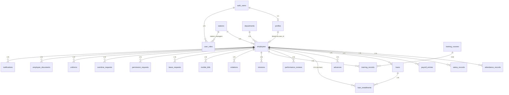
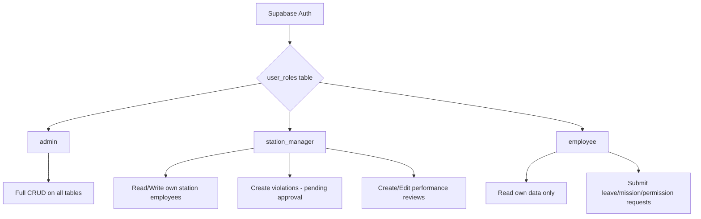
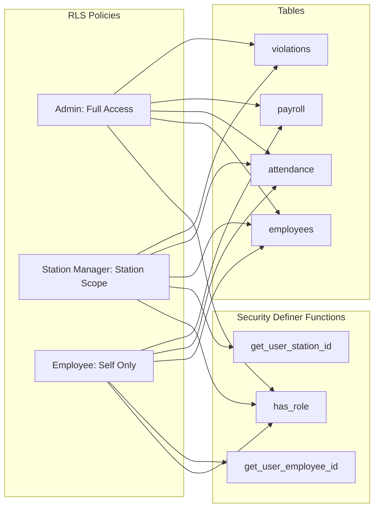
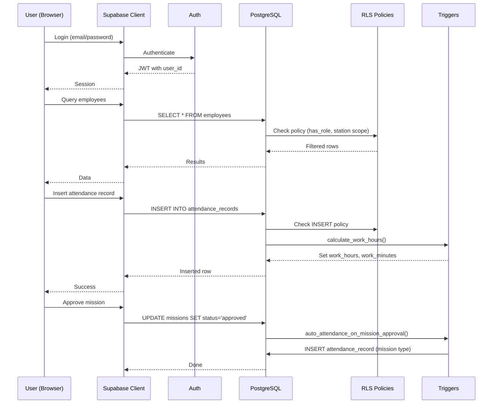

# HR System — Supabase Architecture

## Overview

This document describes the full Postgres schema, RLS policies, and database functions/triggers for the HR management system. The system supports three roles: **admin**, **station_manager**, and **employee**, all enforced via Row-Level Security.

---

## Entity Relationship Diagram

## Role-Based Access Model

## Core Tables

### 1. `stations`
| Column | Type | Notes |
|--------|------|-------|
| id | uuid PK | |
| code | text UNIQUE | e.g. 'cairo', 'alex' |
| name_ar | text | |
| name_en | text | |
| timezone | text | default 'Africa/Cairo' |
| is_active | boolean | default true |

### 2. `departments`
| Column | Type | Notes |
|--------|------|-------|
| id | uuid PK | |
| name_ar | text | |
| name_en | text | |
| is_active | boolean | default true |

### 3. `profiles`
Mirrors `auth.users` for queryable user data.
| Column | Type | Notes |
|--------|------|-------|
| id | uuid PK (= auth.users.id) | |
| email | text | |
| full_name | text | |
| avatar_url | text | |
| created_at | timestamptz | |

### 4. `user_roles`
| Column | Type | Notes |
|--------|------|-------|
| id | uuid PK | |
| user_id | uuid FK profiles | |
| role | app_role enum | admin, station_manager, employee |
| station_id | uuid FK stations | nullable, for station_manager |
| employee_id | uuid FK employees | nullable, for employee role |

### 5. `employees`
| Column | Type | Notes |
|--------|------|-------|
| id | uuid PK | |
| user_id | uuid FK profiles | nullable (not all employees have login) |
| employee_code | text UNIQUE | e.g. 'Emp001' |
| name_ar | text | |
| name_en | text | |
| station_id | uuid FK stations | |
| department_id | uuid FK departments | |
| job_title_ar | text | |
| job_title_en | text | |
| phone | text | |
| email | text | |
| status | employee_status enum | active, inactive, suspended |
| hire_date | date | |
| birth_date | date | |
| gender | text | |
| national_id | text | |
| basic_salary | numeric(12,2) | |
| bank_name | text | |
| bank_account_number | text | |
| contract_type | text | |
| ... (all employee fields) | | |
| created_at | timestamptz | |
| updated_at | timestamptz | |

## Module Tables

### 6. `attendance_records`
| Column | Type | Notes |
|--------|------|-------|
| id | uuid PK | |
| employee_id | uuid FK employees | |
| date | date | |
| check_in | timestamptz | |
| check_out | timestamptz | |
| work_hours | numeric(5,2) | computed by trigger |
| work_minutes | integer | computed by trigger |
| status | text | present, absent, late, mission |
| is_late | boolean | default false |
| notes | text | |
| created_at | timestamptz | |

### 7. `salary_records`
Annual salary structure per employee.
| Column | Type | Notes |
|--------|------|-------|
| id | uuid PK | |
| employee_id | uuid FK employees | |
| year | text | |
| basic_salary | numeric(12,2) | |
| transport_allowance | numeric(12,2) | |
| incentives | numeric(12,2) | |
| living_allowance | numeric(12,2) | |
| station_allowance | numeric(12,2) | |
| mobile_allowance | numeric(12,2) | |
| employee_insurance | numeric(12,2) | |
| employer_social_insurance | numeric(12,2) | |
| health_insurance | numeric(12,2) | |
| income_tax | numeric(12,2) | |
| UNIQUE(employee_id, year) | | |

### 8. `payroll_entries`
Monthly processed payroll.
| Column | Type | Notes |
|--------|------|-------|
| id | uuid PK | |
| employee_id | uuid FK employees | |
| month | text | '01'-'12' |
| year | text | |
| basic_salary | numeric(12,2) | |
| gross | numeric(12,2) | |
| total_deductions | numeric(12,2) | |
| net_salary | numeric(12,2) | |
| ... (all payroll fields) | | |
| processed_at | timestamptz | |
| UNIQUE(employee_id, month, year) | | |

### 9. `loans`
| Column | Type | Notes |
|--------|------|-------|
| id | uuid PK | |
| employee_id | uuid FK employees | |
| amount | numeric(12,2) | |
| monthly_installment | numeric(12,2) | computed by trigger |
| installments_count | integer | |
| paid_count | integer | default 0 |
| remaining | numeric(12,2) | computed |
| status | text | active, completed, defaulted |
| start_date | date | |
| created_at | timestamptz | |

### 10. `loan_installments`
Auto-generated by trigger on loan creation.
| Column | Type | Notes |
|--------|------|-------|
| id | uuid PK | |
| loan_id | uuid FK loans | |
| employee_id | uuid FK employees | |
| installment_number | integer | |
| amount | numeric(12,2) | |
| due_date | date | |
| status | text | pending, paid, overdue |
| paid_at | timestamptz | |

### 11. `advances`
| Column | Type | Notes |
|--------|------|-------|
| id | uuid PK | |
| employee_id | uuid FK employees | |
| amount | numeric(12,2) | |
| deduction_month | text | YYYY-MM |
| status | text | pending, approved, deducted |
| reason | text | |
| created_at | timestamptz | |

### 12. `performance_reviews`
| Column | Type | Notes |
|--------|------|-------|
| id | uuid PK | |
| employee_id | uuid FK employees | |
| reviewer_id | uuid FK profiles | |
| quarter | text | Q1-Q4 |
| year | text | |
| score | numeric(4,1) | computed from criteria |
| status | text | draft, submitted, approved |
| criteria | jsonb | array of {name, score, weight} |
| strengths | text | |
| improvements | text | |
| goals | text | |
| manager_comments | text | |
| review_date | date | |
| created_at | timestamptz | |

### 13. `training_courses`
| Column | Type | Notes |
|--------|------|-------|
| id | uuid PK | |
| name_ar | text | |
| name_en | text | |
| description | text | |
| duration_hours | integer | |
| is_active | boolean | default true |

### 14. `training_records`
| Column | Type | Notes |
|--------|------|-------|
| id | uuid PK | |
| employee_id | uuid FK employees | |
| course_id | uuid FK training_courses | |
| status | text | enrolled, completed, cancelled |
| start_date | date | |
| end_date | date | |
| score | numeric(4,1) | |

### 15. `missions`
| Column | Type | Notes |
|--------|------|-------|
| id | uuid PK | |
| employee_id | uuid FK employees | |
| mission_type | text | morning, evening, full_day |
| destination | text | |
| reason | text | |
| date | date | |
| check_in | time | auto-set by type |
| check_out | time | auto-set by type |
| hours | numeric(4,1) | |
| status | text | pending, approved, rejected |
| approved_by | uuid FK profiles | |
| created_at | timestamptz | |

### 16. `violations`
| Column | Type | Notes |
|--------|------|-------|
| id | uuid PK | |
| employee_id | uuid FK employees | |
| created_by | uuid FK profiles | |
| type | text | |
| description | text | |
| penalty | text | |
| date | date | |
| status | text | pending, active, resolved |
| approved_by | uuid FK profiles | |
| approved_at | timestamptz | |
| created_at | timestamptz | |

### 17. `mobile_bills`
| Column | Type | Notes |
|--------|------|-------|
| id | uuid PK | |
| employee_id | uuid FK employees | |
| amount | numeric(12,2) | |
| deduction_month | text | YYYY-MM |
| status | text | pending, deducted |
| uploaded_by | uuid FK profiles | |
| UNIQUE(employee_id, deduction_month) | | upsert support |

### 18. `leave_requests`
| Column | Type | Notes |
|--------|------|-------|
| id | uuid PK | |
| employee_id | uuid FK employees | |
| leave_type | text | annual, sick, emergency, unpaid |
| start_date | date | |
| end_date | date | |
| days | integer | |
| reason | text | |
| status | text | pending, approved, rejected |
| approved_by | uuid FK profiles | |
| rejection_reason | text | |
| created_at | timestamptz | |

### 19. `permission_requests`
| Column | Type | Notes |
|--------|------|-------|
| id | uuid PK | |
| employee_id | uuid FK employees | |
| permission_type | text | |
| date | date | |
| start_time | time | |
| end_time | time | |
| hours | numeric(4,1) | |
| reason | text | |
| status | text | pending, approved, rejected |
| created_at | timestamptz | |

### 20. `overtime_requests`
| Column | Type | Notes |
|--------|------|-------|
| id | uuid PK | |
| employee_id | uuid FK employees | |
| date | date | |
| hours | numeric(4,1) | |
| reason | text | |
| status | text | pending, approved, rejected |
| created_at | timestamptz | |

### 21. `uniforms`
| Column | Type | Notes |
|--------|------|-------|
| id | uuid PK | |
| employee_id | uuid FK employees | |
| type_ar | text | |
| type_en | text | |
| quantity | integer | |
| unit_price | numeric(12,2) | |
| total_price | numeric(12,2) | computed |
| delivery_date | date | |
| notes | text | |

### 22. `employee_documents`
| Column | Type | Notes |
|--------|------|-------|
| id | uuid PK | |
| employee_id | uuid FK employees | |
| name | text | |
| type | text | |
| file_url | text | |
| uploaded_at | timestamptz | |

### 23. `notifications`
| Column | Type | Notes |
|--------|------|-------|
| id | uuid PK | |
| user_id | uuid FK profiles | |
| employee_id | uuid FK employees | nullable |
| title_ar | text | |
| title_en | text | |
| desc_ar | text | |
| desc_en | text | |
| type | text | success, warning, info, error |
| module | text | |
| is_read | boolean | default false |
| created_at | timestamptz | |

### 24. `assets`
| Column | Type | Notes |
|--------|------|-------|
| id | uuid PK | |
| asset_code | text UNIQUE | |
| name_ar | text | |
| name_en | text | |
| category | text | |
| brand | text | |
| model | text | |
| serial_number | text | |
| purchase_date | date | |
| purchase_price | numeric(12,2) | |
| status | text | available, assigned, maintenance, retired |
| condition | text | |
| location | text | |
| assigned_to | uuid FK employees | nullable |
| notes | text | |
| created_at | timestamptz | |

---

## Database Functions

### `calculate_work_hours()` — Trigger
Fires BEFORE INSERT/UPDATE on `attendance_records`. Computes `work_hours` and `work_minutes` from `check_in` and `check_out`, handling overnight shifts.

### `generate_loan_installments()` — Trigger  
Fires AFTER INSERT on `loans`. Auto-generates rows in `loan_installments` based on `installments_count` and `amount`.

### `upsert_mobile_bill()` — Function
Called via RPC. If a bill for the same employee+month exists, updates amount; otherwise inserts.

### `calculate_payroll_net()` — Trigger
Fires BEFORE INSERT/UPDATE on `payroll_entries`. Computes `gross`, `total_deductions`, and `net_salary` from component fields.

### `auto_attendance_on_mission_approval()` — Trigger
Fires AFTER UPDATE on `missions` when status changes to 'approved'. Creates an attendance record with mission-type hours.

### `has_role()` — Security Definer
Used in all RLS policies. Checks `user_roles` without causing recursive policy evaluation.

### `get_user_station_id()` — Security Definer
Returns the station_id for a station_manager user. Used in RLS policies for station-scoped access.

### `get_user_employee_id()` — Security Definer
Returns the employee_id for an employee user. Used in RLS policies for self-access.

---

## RLS Policy Strategy

### Policy Pattern
- **Admin**: `has_role(auth.uid(), 'admin')` → full CRUD
- **Station Manager**: `has_role(auth.uid(), 'station_manager') AND employee.station_id = get_user_station_id(auth.uid())`
- **Employee**: `has_role(auth.uid(), 'employee') AND employee.id = get_user_employee_id(auth.uid())`

---

## Data Flow

