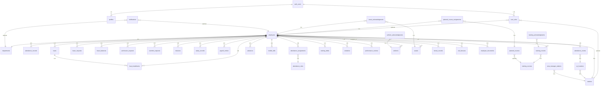

# Supabase Architecture Document
## HR Management System — Link Agency

**Last Updated:** 2026-03-24  
**Project ID:** iygkzkglrkdrmuyeuiht  
**Total Tables:** 43 (all with RLS enabled)  
**Total Views:** 1  
**Total Functions:** 35  
**Total Triggers:** 65  
**Edge Functions:** 11  

---

## Roles

```sql
CREATE TYPE public.app_role AS ENUM ('admin', 'station_manager', 'employee', 'kiosk', 'training_manager', 'hr', 'area_manager');
CREATE TYPE public.employee_status AS ENUM ('active', 'inactive', 'suspended');
```

### Role Hierarchy

| Role | Access Level |
|------|-------------|
| `admin` | Full CRUD on all tables |
| `hr` | Full CRUD on most tables (except payroll_entries, audit_logs) |
| `station_manager` | Read employees in own station, manage attendance/leaves for station |
| `area_manager` | Like station_manager but across multiple assigned stations |
| `training_manager` | Manage training courses, records, debts, planned courses |
| `employee` | Read own data only (attendance, leaves, salary, etc.) |
| `kiosk` | Generate QR tokens for attendance |

---

## Entity Relationship Overview


```mermaid
erDiagram
    auth_users ||--o{ profiles : "1:1"
    auth_users ||--o{ user_roles : "1:N"
    user_roles }o--|| employees : "optional"
    user_roles }o--|| stations : "optional"
    employees }o--|| departments : "N:1"
    employees }o--|| stations : "N:1"
    employees ||--o{ attendance_records : "1:N"
    employees ||--o{ attendance_events : "1:N"
    employees ||--o{ leave_requests : "1:N"
    employees ||--o{ leave_balances : "1:N"
    employees ||--o{ permission_requests : "1:N"
    employees ||--o{ overtime_requests : "1:N"
    employees ||--o{ missions : "1:N"
    employees ||--o{ salary_records : "1:N"
    employees ||--o{ payroll_entries : "1:N"
    employees ||--o{ loans : "1:N"
    employees ||--o{ loan_installments : "1:N"
    employees ||--o{ advances : "1:N"
    employees ||--o{ mobile_bills : "1:N"
    employees ||--o{ training_records : "1:N"
    employees ||--o{ training_debts : "1:N"
    employees ||--o{ violations : "1:N"
    employees ||--o{ performance_reviews : "1:N"
    employees ||--o{ uniforms : "1:N"
    employees ||--o{ assets : "assigned_to"
    employees ||--o{ bonus_records : "1:N"
    employees ||--o{ eid_bonuses : "1:N"
    employees ||--o{ employee_documents : "1:N"
    employees ||--o{ attendance_assignments : "1:N"
    attendance_assignments }o--|| attendance_rules : "N:1"
    loans ||--o{ loan_installments : "1:N"
    training_records }o--|| training_courses : "N:1"
    planned_courses }o--|| training_courses : "optional"
    planned_course_assignments }o--|| planned_courses : "N:1"
    planned_course_assignments }o--|| employees : "N:1"
    attendance_events }o--|| qr_locations : "N:1"
    qr_locations }o--|| stations : "N:1"
    area_manager_stations }o--|| stations : "N:1"
    asset_acknowledgments }o--|| assets : "N:1"
    asset_acknowledgments }o--|| employees : "N:1"
    training_acknowledgments }o--|| training_records : "N:1"
    uniform_acknowledgments }o--|| uniforms : "N:1"
    notifications }o--|| departments : "optional"
    notifications }o--|| employees : "optional"
```

---

## Tables (43 total)

### advances

| Column | Type | Nullable | Default |
|--------|------|----------|--------|
| id | uuid | No | gen_random_uuid() |
| employee_id | uuid | No | — |
| amount | numeric | No | — |
| deduction_month | text | No | — |
| status | text | No | 'pending' |
| reason | text | Yes | — |
| created_at | timestamptz | No | now() |

### area_manager_stations

| Column | Type | Nullable | Default |
|--------|------|----------|--------|
| id | uuid | No | gen_random_uuid() |
| user_id | uuid | No | — |
| station_id | uuid | No | — |
| created_at | timestamptz | No | now() |

### asset_acknowledgments

| Column | Type | Nullable | Default |
|--------|------|----------|--------|
| id | uuid | No | gen_random_uuid() |
| asset_id | uuid | No | — |
| employee_id | uuid | No | — |
| acknowledged_at | timestamptz | No | now() |

### assets

| Column | Type | Nullable | Default |
|--------|------|----------|--------|
| id | uuid | No | gen_random_uuid() |
| asset_code | text | No | — |
| name_ar | text | No | — |
| name_en | text | No | — |
| category | text | No | 'other' |
| brand | text | Yes | — |
| model | text | Yes | — |
| serial_number | text | Yes | — |
| purchase_date | date | Yes | — |
| purchase_price | numeric | Yes | 0 |
| status | text | No | 'available' |
| condition | text | Yes | 'good' |
| location | text | Yes | — |
| assigned_to | uuid | Yes | — |
| notes | text | Yes | — |
| created_at | timestamptz | No | now() |

### attendance_assignments

| Column | Type | Nullable | Default |
|--------|------|----------|--------|
| id | uuid | No | gen_random_uuid() |
| employee_id | uuid | No | — |
| rule_id | uuid | No | — |
| station_id | uuid | Yes | — |
| shift_id | text | Yes | — |
| effective_from | date | No | CURRENT_DATE |
| is_active | boolean | No | true |
| created_at | timestamptz | No | now() |

### attendance_events

| Column | Type | Nullable | Default |
|--------|------|----------|--------|
| id | uuid | No | gen_random_uuid() |
| user_id | uuid | No | — |
| employee_id | uuid | Yes | — |
| event_type | text | No | — |
| device_id | text | No | — |
| location_id | uuid | Yes | — |
| gps_lat | float8 | Yes | — |
| gps_lng | float8 | Yes | — |
| token_ts | timestamptz | No | — |
| scan_time | timestamptz | No | now() |

### attendance_records

| Column | Type | Nullable | Default |
|--------|------|----------|--------|
| id | uuid | No | gen_random_uuid() |
| employee_id | uuid | No | — |
| date | date | No | — |
| check_in | timestamptz | Yes | — |
| check_out | timestamptz | Yes | — |
| work_hours | numeric | Yes | 0 |
| work_minutes | integer | Yes | 0 |
| status | text | No | 'present' |
| is_late | boolean | Yes | false |
| notes | text | Yes | — |
| created_at | timestamptz | No | now() |

### attendance_rules

| Column | Type | Nullable | Default |
|--------|------|----------|--------|
| id | uuid | No | gen_random_uuid() |
| name | text | No | — |
| name_ar | text | No | — |
| description | text | Yes | '' |
| description_ar | text | Yes | '' |
| schedule_type | text | No | 'fixed' |
| is_active | boolean | No | true |
| fixed_schedule | jsonb | Yes | — |
| flexible_schedule | jsonb | Yes | — |
| fully_flexible_schedule | jsonb | Yes | — |
| shift_schedule | jsonb | Yes | — |
| weekend_days | jsonb | Yes | '[5, 6]' |
| working_days_per_week | integer | Yes | 5 |
| max_overtime_hours_daily | numeric | Yes | 4 |
| max_overtime_hours_weekly | numeric | Yes | 20 |
| created_at | timestamptz | No | now() |

### audit_logs

| Column | Type | Nullable | Default |
|--------|------|----------|--------|
| id | uuid | No | gen_random_uuid() |
| user_id | uuid | No | — |
| action_type | text | No | — |
| affected_table | text | No | — |
| record_id | text | Yes | — |
| old_data | jsonb | Yes | — |
| new_data | jsonb | Yes | — |
| ip_address | text | Yes | — |
| user_agent | text | Yes | — |
| created_at | timestamptz | No | now() |

### bonus_records

| Column | Type | Nullable | Default |
|--------|------|----------|--------|
| id | uuid | No | gen_random_uuid() |
| employee_id | uuid | No | — |
| year | text | No | — |
| bonus_number | integer | No | — |
| percentage | numeric | No | 0 |
| gross_salary | numeric | No | 0 |
| amount | numeric | No | 0 |
| hire_date | date | Yes | — |
| job_level | text | Yes | — |
| employee_name | text | Yes | — |
| employee_code | text | Yes | — |
| station_name | text | Yes | — |
| department_name | text | Yes | — |
| job_title | text | Yes | — |
| bank_account_number | text | Yes | — |
| bank_id_number | text | Yes | — |
| bank_name | text | Yes | — |
| bank_account_type | text | Yes | — |
| created_at | timestamptz | No | now() |

### departments

| Column | Type | Nullable | Default |
|--------|------|----------|--------|
| id | uuid | No | gen_random_uuid() |
| name_ar | text | No | — |
| name_en | text | No | — |
| is_active | boolean | No | true |
| created_at | timestamptz | No | now() |

### device_alerts

| Column | Type | Nullable | Default |
|--------|------|----------|--------|
| id | uuid | No | gen_random_uuid() |
| user_id | uuid | No | — |
| device_id | text | No | — |
| reason | text | No | — |
| meta | jsonb | Yes | — |
| triggered_at | timestamptz | No | now() |

### eid_bonuses

| Column | Type | Nullable | Default |
|--------|------|----------|--------|
| id | uuid | No | gen_random_uuid() |
| employee_id | uuid | No | — |
| year | text | No | — |
| bonus_number | integer | No | — |
| amount | numeric | No | 0 |
| hire_date | date | Yes | — |
| employee_name | text | Yes | — |
| employee_code | text | Yes | — |
| station_name | text | Yes | — |
| department_name | text | Yes | — |
| job_title | text | Yes | — |
| job_level | text | Yes | — |
| bank_account_type | text | Yes | — |
| bank_account_number | text | Yes | — |
| bank_id_number | text | Yes | — |
| bank_name | text | Yes | — |
| created_at | timestamptz | No | now() |

### employee_documents

| Column | Type | Nullable | Default |
|--------|------|----------|--------|
| id | uuid | No | gen_random_uuid() |
| employee_id | uuid | No | — |
| name | text | No | — |
| file_path | text | No | — |
| file_type | text | Yes | — |
| notes | text | Yes | — |
| uploaded_at | timestamptz | No | now() |

### employees

| Column | Type | Nullable | Default |
|--------|------|----------|--------|
| id | uuid | No | gen_random_uuid() |
| user_id | uuid | Yes | — |
| employee_code | text | No | — |
| name_ar | text | No | — |
| name_en | text | No | — |
| first_name | text | Yes | — |
| father_name | text | Yes | — |
| family_name | text | Yes | — |
| station_id | uuid | Yes | — |
| department_id | uuid | Yes | — |
| job_title_ar | text | Yes | '' |
| job_title_en | text | Yes | '' |
| job_level | text | Yes | — |
| job_degree | text | Yes | — |
| dept_code | text | Yes | — |
| phone | text | Yes | '' |
| email | text | Yes | '' |
| gender | text | Yes | — |
| avatar | text | Yes | — |
| status | employee_status | No | 'active' |
| employment_status | text | Yes | 'active' |
| contract_type | text | Yes | — |
| hire_date | date | Yes | — |
| resignation_date | date | Yes | — |
| resigned | boolean | Yes | false |
| resignation_reason | text | Yes | — |
| birth_date | date | Yes | — |
| birth_place | text | Yes | — |
| birth_governorate | text | Yes | — |
| religion | text | Yes | — |
| nationality | text | Yes | — |
| marital_status | text | Yes | — |
| children_count | integer | Yes | 0 |
| education_ar | text | Yes | — |
| graduation_year | text | Yes | — |
| military_status | text | Yes | — |
| national_id | text | Yes | — |
| id_issue_date | date | Yes | — |
| id_expiry_date | date | Yes | — |
| issuing_authority | text | Yes | — |
| address | text | Yes | — |
| city | text | Yes | — |
| governorate | text | Yes | — |
| social_insurance_no | text | Yes | — |
| social_insurance_start_date | date | Yes | — |
| social_insurance_end_date | date | Yes | — |
| health_insurance_card_no | text | Yes | — |
| has_health_insurance | boolean | Yes | false |
| has_social_insurance | boolean | Yes | false |
| basic_salary | numeric | Yes | 0 |
| bank_name | text | Yes | — |
| bank_account_number | text | Yes | — |
| bank_id_number | text | Yes | — |
| bank_account_type | text | Yes | — |
| annual_leave_balance | numeric | Yes | 21 |
| sick_leave_balance | numeric | Yes | 7 |
| notes | text | Yes | — |
| created_at | timestamptz | No | now() |
| updated_at | timestamptz | No | now() |

### leave_balances

| Column | Type | Nullable | Default |
|--------|------|----------|--------|
| id | uuid | No | gen_random_uuid() |
| employee_id | uuid | No | — |
| year | integer | No | — |
| annual_total | numeric | Yes | 21 |
| annual_used | numeric | Yes | 0 |
| sick_total | numeric | Yes | 7 |
| sick_used | numeric | Yes | 0 |
| casual_total | numeric | Yes | 7 |
| casual_used | numeric | Yes | 0 |
| permissions_used | numeric | Yes | 0 |
| created_at | timestamptz | No | now() |

### leave_requests

| Column | Type | Nullable | Default |
|--------|------|----------|--------|
| id | uuid | No | gen_random_uuid() |
| employee_id | uuid | No | — |
| leave_type | text | No | — |
| start_date | date | No | — |
| end_date | date | No | — |
| days | numeric | No | 1 |
| reason | text | Yes | — |
| status | text | No | 'pending' |
| rejection_reason | text | Yes | — |
| approved_by | uuid | Yes | — |
| created_at | timestamptz | No | now() |

### loan_installments

| Column | Type | Nullable | Default |
|--------|------|----------|--------|
| id | uuid | No | gen_random_uuid() |
| loan_id | uuid | No | — |
| employee_id | uuid | No | — |
| installment_number | integer | No | — |
| amount | numeric | No | 0 |
| due_date | date | No | — |
| status | text | No | 'pending' |
| paid_at | timestamptz | Yes | — |
| created_at | timestamptz | No | now() |

### loans

| Column | Type | Nullable | Default |
|--------|------|----------|--------|
| id | uuid | No | gen_random_uuid() |
| employee_id | uuid | No | — |
| amount | numeric | No | 0 |
| monthly_installment | numeric | Yes | 0 |
| installments_count | integer | Yes | 1 |
| paid_count | integer | Yes | 0 |
| remaining | numeric | Yes | 0 |
| start_date | date | No | — |
| status | text | No | 'active' |
| reason | text | Yes | — |
| created_at | timestamptz | No | now() |

### missions

| Column | Type | Nullable | Default |
|--------|------|----------|--------|
| id | uuid | No | gen_random_uuid() |
| employee_id | uuid | No | — |
| date | date | No | — |
| mission_type | text | No | 'full_day' |
| destination | text | Yes | — |
| reason | text | Yes | — |
| check_in | time | Yes | — |
| check_out | time | Yes | — |
| status | text | No | 'pending' |
| approved_by | uuid | Yes | — |
| created_at | timestamptz | No | now() |

### mobile_bills

| Column | Type | Nullable | Default |
|--------|------|----------|--------|
| id | uuid | No | gen_random_uuid() |
| employee_id | uuid | No | — |
| amount | numeric | No | 0 |
| deduction_month | text | No | — |
| status | text | No | 'pending' |
| uploaded_by | uuid | Yes | — |
| created_at | timestamptz | No | now() |

### notifications

| Column | Type | Nullable | Default |
|--------|------|----------|--------|
| id | uuid | No | gen_random_uuid() |
| user_id | uuid | No | — |
| employee_id | uuid | Yes | — |
| department_id | uuid | Yes | — |
| title_ar | text | No | — |
| title_en | text | Yes | — |
| desc_ar | text | Yes | — |
| desc_en | text | Yes | — |
| type | text | Yes | 'info' |
| module | text | Yes | 'general' |
| target_type | text | Yes | — |
| is_read | boolean | Yes | false |
| created_at | timestamptz | No | now() |

### overtime_requests

| Column | Type | Nullable | Default |
|--------|------|----------|--------|
| id | uuid | No | gen_random_uuid() |
| employee_id | uuid | No | — |
| date | date | No | — |
| hours | numeric | No | 0 |
| overtime_type | text | No | 'regular' |
| reason | text | Yes | — |
| status | text | No | 'pending' |
| created_at | timestamptz | No | now() |

### payroll_entries

| Column | Type | Nullable | Default |
|--------|------|----------|--------|
| id | uuid | No | gen_random_uuid() |
| employee_id | uuid | No | — |
| month | text | No | — |
| year | text | No | — |
| basic_salary | numeric | Yes | 0 |
| transport_allowance | numeric | Yes | 0 |
| incentives | numeric | Yes | 0 |
| station_allowance | numeric | Yes | 0 |
| mobile_allowance | numeric | Yes | 0 |
| living_allowance | numeric | Yes | 0 |
| overtime_pay | numeric | Yes | 0 |
| bonus_type | text | Yes | 'amount' |
| bonus_value | numeric | Yes | 0 |
| bonus_amount | numeric | Yes | 0 |
| gross | numeric | Yes | 0 |
| employee_insurance | numeric | Yes | 0 |
| loan_payment | numeric | Yes | 0 |
| advance_amount | numeric | Yes | 0 |
| mobile_bill | numeric | Yes | 0 |
| leave_days | numeric | Yes | 0 |
| leave_deduction | numeric | Yes | 0 |
| penalty_type | text | Yes | 'amount' |
| penalty_value | numeric | Yes | 0 |
| penalty_amount | numeric | Yes | 0 |
| total_deductions | numeric | Yes | 0 |
| net_salary | numeric | Yes | 0 |
| employer_social_insurance | numeric | Yes | 0 |
| health_insurance | numeric | Yes | 0 |
| income_tax | numeric | Yes | 0 |
| processed_at | timestamptz | No | now() |

### performance_reviews

| Column | Type | Nullable | Default |
|--------|------|----------|--------|
| id | uuid | No | gen_random_uuid() |
| employee_id | uuid | No | — |
| year | text | No | — |
| quarter | text | No | — |
| score | numeric | Yes | — |
| status | text | No | 'draft' |
| reviewer_id | uuid | Yes | — |
| comments | text | Yes | — |
| strengths | text | Yes | — |
| improvements | text | Yes | — |
| goals | text | Yes | — |
| created_at | timestamptz | No | now() |

### permission_profiles

| Column | Type | Nullable | Default |
|--------|------|----------|--------|
| id | uuid | No | gen_random_uuid() |
| name_ar | text | No | — |
| name_en | text | No | — |
| modules | jsonb | No | '[]' |
| created_at | timestamptz | No | now() |

### permission_requests

| Column | Type | Nullable | Default |
|--------|------|----------|--------|
| id | uuid | No | gen_random_uuid() |
| employee_id | uuid | No | — |
| date | date | No | — |
| start_time | time | No | — |
| end_time | time | No | — |
| hours | numeric | Yes | 0 |
| permission_type | text | No | — |
| reason | text | Yes | — |
| status | text | No | 'pending' |
| created_at | timestamptz | No | now() |

### planned_course_assignments

| Column | Type | Nullable | Default |
|--------|------|----------|--------|
| id | uuid | No | gen_random_uuid() |
| planned_course_id | uuid | No | — |
| employee_id | uuid | No | — |
| actual_date | date | Yes | — |
| created_at | timestamptz | No | now() |

### planned_courses

| Column | Type | Nullable | Default |
|--------|------|----------|--------|
| id | uuid | No | gen_random_uuid() |
| course_id | uuid | Yes | — |
| course_code | text | No | '' |
| course_name | text | No | '' |
| provider | text | Yes | '' |
| duration | text | Yes | '' |
| trainer | text | Yes | '' |
| location | text | Yes | '' |
| planned_date | date | Yes | — |
| participants | integer | Yes | 0 |
| cost | numeric | Yes | 0 |
| status | text | No | 'scheduled' |
| created_at | timestamptz | No | now() |

### profiles

| Column | Type | Nullable | Default |
|--------|------|----------|--------|
| id | uuid | No | — |
| email | text | Yes | — |
| full_name | text | Yes | — |
| created_at | timestamptz | No | now() |

### qr_locations

| Column | Type | Nullable | Default |
|--------|------|----------|--------|
| id | uuid | No | gen_random_uuid() |
| station_id | uuid | Yes | — |
| name_ar | text | No | — |
| name_en | text | No | — |
| latitude | float8 | Yes | — |
| longitude | float8 | Yes | — |
| radius_m | integer | Yes | 150 |
| is_active | boolean | No | true |
| created_at | timestamptz | No | now() |

### salary_records

| Column | Type | Nullable | Default |
|--------|------|----------|--------|
| id | uuid | No | gen_random_uuid() |
| employee_id | uuid | No | — |
| year | text | No | — |
| basic_salary | numeric | Yes | 0 |
| transport_allowance | numeric | Yes | 0 |
| incentives | numeric | Yes | 0 |
| station_allowance | numeric | Yes | 0 |
| mobile_allowance | numeric | Yes | 0 |
| living_allowance | numeric | Yes | 0 |
| employee_insurance | numeric | Yes | 0 |
| employer_social_insurance | numeric | Yes | 0 |
| health_insurance | numeric | Yes | 0 |
| income_tax | numeric | Yes | 0 |
| notes | text | Yes | — |
| created_at | timestamptz | No | now() |

### stations

| Column | Type | Nullable | Default |
|--------|------|----------|--------|
| id | uuid | No | gen_random_uuid() |
| code | text | No | — |
| name_ar | text | No | — |
| name_en | text | No | — |
| timezone | text | No | 'Africa/Cairo' |
| checkin_method | text | No | 'qr' |
| is_active | boolean | No | true |
| created_at | timestamptz | No | now() |

### training_acknowledgments

| Column | Type | Nullable | Default |
|--------|------|----------|--------|
| id | uuid | No | gen_random_uuid() |
| training_record_id | uuid | No | — |
| employee_id | uuid | No | — |
| acknowledged_at | timestamptz | No | now() |

### training_courses

| Column | Type | Nullable | Default |
|--------|------|----------|--------|
| id | uuid | No | gen_random_uuid() |
| code | text | No | — |
| name_ar | text | No | — |
| name_en | text | No | — |
| category | text | Yes | — |
| description | text | Yes | — |
| duration_hours | numeric | Yes | — |
| is_active | boolean | No | true |
| created_at | timestamptz | No | now() |

### training_debts

| Column | Type | Nullable | Default |
|--------|------|----------|--------|
| id | uuid | No | gen_random_uuid() |
| employee_id | uuid | No | — |
| course_name | text | No | — |
| cost | numeric | No | 0 |
| actual_date | date | No | — |
| expiry_date | date | No | — |
| created_at | timestamptz | No | now() |

### training_records

| Column | Type | Nullable | Default |
|--------|------|----------|--------|
| id | uuid | No | gen_random_uuid() |
| employee_id | uuid | No | — |
| course_id | uuid | Yes | — |
| status | text | No | 'enrolled' |
| start_date | date | Yes | — |
| end_date | date | Yes | — |
| planned_date | date | Yes | — |
| score | numeric | Yes | — |
| provider | text | Yes | — |
| location | text | Yes | — |
| cost | numeric | Yes | 0 |
| total_cost | numeric | Yes | 0 |
| has_cert | boolean | Yes | false |
| has_cr | boolean | Yes | false |
| has_ss | boolean | Yes | false |
| has_cb | boolean | Yes | false |
| is_favorite | boolean | Yes | false |
| created_at | timestamptz | No | now() |

### uniform_acknowledgments

| Column | Type | Nullable | Default |
|--------|------|----------|--------|
| id | uuid | No | gen_random_uuid() |
| uniform_id | uuid | No | — |
| employee_id | uuid | No | — |
| acknowledged_at | timestamptz | No | now() |

### uniforms

| Column | Type | Nullable | Default |
|--------|------|----------|--------|
| id | uuid | No | gen_random_uuid() |
| employee_id | uuid | No | — |
| type_ar | text | No | — |
| type_en | text | No | — |
| quantity | integer | No | 1 |
| unit_price | numeric | Yes | 0 |
| total_price | numeric | Yes | 0 |
| delivery_date | date | No | — |
| notes | text | Yes | — |
| created_at | timestamptz | No | now() |

### user_devices

| Column | Type | Nullable | Default |
|--------|------|----------|--------|
| id | uuid | No | gen_random_uuid() |
| user_id | uuid | No | — |
| device_id | text | No | — |
| device_info | jsonb | Yes | — |
| bound_at | timestamptz | No | now() |

### user_module_permissions

| Column | Type | Nullable | Default |
|--------|------|----------|--------|
| id | uuid | No | gen_random_uuid() |
| user_id | uuid | No | — |
| profile_id | uuid | Yes | — |
| custom_modules | jsonb | Yes | — |
| created_at | timestamptz | No | now() |

### user_roles

| Column | Type | Nullable | Default |
|--------|------|----------|--------|
| id | uuid | No | gen_random_uuid() |
| user_id | uuid | No | — |
| role | app_role | No | — |
| station_id | uuid | Yes | — |
| employee_id | uuid | Yes | — |
| created_at | timestamptz | No | now() |

### violations

| Column | Type | Nullable | Default |
|--------|------|----------|--------|
| id | uuid | No | gen_random_uuid() |
| employee_id | uuid | No | — |
| type | text | No | — |
| description | text | Yes | — |
| penalty | text | Yes | — |
| date | date | No | CURRENT_DATE |
| status | text | No | 'pending' |
| created_by | uuid | Yes | — |
| approved_by | uuid | Yes | — |
| approved_at | timestamptz | Yes | — |
| created_at | timestamptz | No | now() |

---

## Views

### employee_limited_view

A restricted view of the `employees` table exposing non-sensitive columns for station managers:

```sql
CREATE OR REPLACE VIEW public.employee_limited_view AS
SELECT id, employee_code, name_ar, name_en, first_name, father_name, family_name,
       email, phone, gender, avatar, status, employment_status, contract_type,
       hire_date, resignation_date, resigned, department_id, station_id,
       job_title_ar, job_title_en, job_level, job_degree, dept_code, user_id,
       created_at, updated_at
FROM employees;
```

---

## Database Functions (35 total)

### Security & Role Functions
| Function | Type | Purpose |
|----------|------|---------|
| `has_role(uuid, app_role)` | SQL, SECURITY DEFINER | Check if user has a specific role |
| `get_user_station_id(uuid)` | SQL, SECURITY DEFINER | Get station_id for station_manager |
| `get_user_employee_id(uuid)` | SQL, SECURITY DEFINER | Get employee_id for employee role |
| `get_area_manager_station_ids(uuid)` | SQL, SECURITY DEFINER | Get all station_ids for area_manager |
| `handle_new_user()` | Trigger | Auto-create profile on auth.users INSERT |
| `update_updated_at()` | Trigger | Update updated_at timestamp |
| `audit_trigger_func()` | Trigger, SECURITY DEFINER | Log INSERT/UPDATE/DELETE to audit_logs |

### Calculation Functions
| Function | Type | Purpose |
|----------|------|---------|
| `calculate_work_hours()` | Trigger | Calculate work_hours/minutes from check_in/out |
| `calculate_payroll_net()` | Trigger | Calculate gross, deductions, net_salary |
| `calculate_loan_fields()` | Trigger | Calculate loan installment amounts |
| `calculate_uniform_total()` | Trigger | Calculate total_price from quantity × unit_price |
| `generate_loan_installments()` | Trigger | Create installment rows on loan INSERT |
| `recalculate_loan_on_update()` | Trigger | Regenerate installments on loan UPDATE |
| `upsert_mobile_bill(uuid, numeric, text, uuid)` | RPC | Upsert mobile bill with ON CONFLICT |

### Leave/Balance Functions
| Function | Type | Purpose |
|----------|------|---------|
| `update_leave_balance_on_approval()` | Trigger | Update leave_balances when leave approved/rejected |
| `reverse_leave_balance_on_delete()` | Trigger | Reverse balance on approved leave deletion |
| `update_permission_balance_on_approval()` | Trigger | Update permissions_used on approval |
| `reverse_permission_balance_on_delete()` | Trigger | Reverse permission balance on delete |
| `update_annual_balance_on_overtime_approval()` | Trigger | Add 1 day to annual leave on overtime approval |
| `reverse_overtime_balance_on_delete()` | Trigger | Reverse annual balance on overtime delete |
| `prevent_permission_on_leave_day()` | Trigger | Block permission request on leave day |
| `auto_attendance_on_mission()` | Trigger | Create attendance record on mission approval |

### Notification Functions
| Function | Type | Purpose |
|----------|------|---------|
| `notify_employee_and_admins(...)` | RPC, SECURITY DEFINER | Send notification to employee + all admins/HR |
| `notify_on_advance_insert()` | Trigger | Notify on new advance |
| `notify_on_asset_assignment()` | Trigger | Notify on asset assignment change |
| `notify_on_bonus_record()` | Trigger | Notify on bonus record |
| `notify_on_leave_status_change()` | Trigger | Notify on leave approval/rejection |
| `notify_on_loan_insert()` | Trigger | Notify on new loan |
| `notify_on_mission_status_change()` | Trigger | Notify on mission approval/rejection |
| `notify_on_overtime_status_change()` | Trigger | Notify on overtime approval/rejection |
| `notify_on_payroll_entry()` | Trigger | Notify on payroll processing |
| `notify_on_performance_review()` | Trigger | Notify on performance review create/complete |
| `notify_on_permission_status_change()` | Trigger | Notify on permission approval/rejection |
| `notify_on_training_assignment()` | Trigger | Notify on training course assignment |
| `notify_on_uniform_assignment()` | Trigger | Notify on uniform delivery |

---

## Triggers (65 total)

| Table | Trigger | Event | Function |
|-------|---------|-------|----------|
| advances | audit_advances | INSERT/UPDATE/DELETE | audit_trigger_func() |
| advances | trg_notify_advance_insert | INSERT | notify_on_advance_insert() |
| assets | audit_assets | INSERT/UPDATE/DELETE | audit_trigger_func() |
| assets | trg_notify_asset_assignment | UPDATE | notify_on_asset_assignment() |
| attendance_records | trg_calc_work_hours | INSERT/UPDATE | calculate_work_hours() |
| bonus_records | audit_bonus_records | INSERT/UPDATE/DELETE | audit_trigger_func() |
| bonus_records | trg_notify_bonus_record | INSERT | notify_on_bonus_record() |
| eid_bonuses | audit_eid_bonuses | INSERT/UPDATE/DELETE | audit_trigger_func() |
| employees | audit_employees | INSERT/UPDATE/DELETE | audit_trigger_func() |
| employees | trg_employees_updated_at | UPDATE | update_updated_at() |
| leave_requests | audit_leave_requests | INSERT/UPDATE/DELETE | audit_trigger_func() |
| leave_requests | trg_notify_leave_status | UPDATE | notify_on_leave_status_change() |
| leave_requests | trg_reverse_leave_on_delete | DELETE | reverse_leave_balance_on_delete() |
| leave_requests | trg_update_leave_balance | UPDATE | update_leave_balance_on_approval() |
| leave_requests | trg_update_leave_balance_insert | INSERT | update_leave_balance_on_approval() |
| loans | audit_loans | INSERT/UPDATE/DELETE | audit_trigger_func() |
| loans | trg_calc_loan_fields | INSERT | calculate_loan_fields() |
| loans | trg_generate_installments | INSERT | generate_loan_installments() |
| loans | trg_notify_loan_insert | INSERT | notify_on_loan_insert() |
| loans | trg_recalculate_loan_on_update | UPDATE | recalculate_loan_on_update() |
| missions | trg_auto_attendance_mission | UPDATE | auto_attendance_on_mission() |
| missions | trg_notify_mission_status | UPDATE | notify_on_mission_status_change() |
| overtime_requests | trg_notify_overtime_status | UPDATE | notify_on_overtime_status_change() |
| overtime_requests | trg_overtime_annual_balance | UPDATE | update_annual_balance_on_overtime_approval() |
| overtime_requests | trg_reverse_overtime_on_delete | DELETE | reverse_overtime_balance_on_delete() |
| payroll_entries | audit_payroll_entries | INSERT/UPDATE/DELETE | audit_trigger_func() |
| payroll_entries | trg_calc_payroll | INSERT/UPDATE | calculate_payroll_net() |
| payroll_entries | trg_notify_payroll_entry | INSERT | notify_on_payroll_entry() |
| performance_reviews | audit_performance_reviews | INSERT/UPDATE/DELETE | audit_trigger_func() |
| performance_reviews | trg_notify_performance_review | INSERT/UPDATE | notify_on_performance_review() |
| permission_requests | trg_notify_permission_status | UPDATE | notify_on_permission_status_change() |
| permission_requests | trg_permission_balance | UPDATE | update_permission_balance_on_approval() |
| permission_requests | trg_prevent_permission_on_leave_day | INSERT | prevent_permission_on_leave_day() |
| permission_requests | trg_reverse_permission_on_delete | DELETE | reverse_permission_balance_on_delete() |
| planned_course_assignments | trg_notify_training_assignment | INSERT | notify_on_training_assignment() |
| profiles | audit_profiles | INSERT/UPDATE/DELETE | audit_trigger_func() |
| uniforms | trg_calc_uniform_total | INSERT/UPDATE | calculate_uniform_total() |
| uniforms | trg_notify_uniform_assignment | INSERT | notify_on_uniform_assignment() |
| user_roles | audit_user_roles | INSERT/UPDATE/DELETE | audit_trigger_func() |

---

## RLS Policy Summary

All 43 tables have RLS enabled. Common patterns:

| Pattern | Description |
|---------|-------------|
| Admin ALL | `has_role(auth.uid(), 'admin')` — full CRUD |
| HR ALL | `has_role(auth.uid(), 'hr')` — full CRUD (most tables) |
| Employee SELECT | `employee_id = get_user_employee_id(auth.uid())` — own data only |
| Employee INSERT | Same as SELECT, for submitting requests |
| Station Manager SELECT | `employee_id IN (SELECT id FROM employees WHERE station_id = get_user_station_id(...))` |
| Station Manager UPDATE | Same scope for approvals |
| Area Manager SELECT/UPDATE | Uses `get_area_manager_station_ids()` for multi-station scope |
| Training Manager ALL | `has_role(auth.uid(), 'training_manager')` — training tables only |
| Kiosk | QR token generation only |
| Public read | stations, departments (authenticated only) |

### Tables with audit_logs restrictions
- `audit_logs`: Admin INSERT + SELECT only (no UPDATE/DELETE)

### Tables with payroll restrictions  
- `payroll_entries`: Admin ALL + Employee self-read (NO HR access)
- `salary_records`: Admin ALL + Employee self-read (NO HR access)

---

## Edge Functions (11 total)

| Function | JWT Required | Description |
|----------|-------------|-------------|
| `setup-user` | No (verify_jwt=false) | Creates auth user + profile + role. First admin = no auth required |
| `delete-user` | No (verify_jwt=false) | Deletes user: clears employee link, roles, permissions, devices, profile, auth |
| `bulk-create-users` | No (verify_jwt=false) | Bulk-creates employee accounts from employee_code + password array |
| `generate-qr-token` | No (verify_jwt=false) | Generates HMAC-signed QR token after server-side geofence check |
| `submit-scan` | No (verify_jwt=false) | Processes QR scan: validates token, geofence, device binding, records attendance |
| `gps-checkin` | No (verify_jwt=false) | GPS-based check-in/out with geofence validation and device binding |
| `send-notification` | No (verify_jwt=false) | Sends notifications to users/departments/stations/broadcast |
| `bulk-import-leaves` | No (verify_jwt=false) | Bulk imports leave/permission/overtime requests from CSV data |
| `bulk-import-training` | No (verify_jwt=false) | Bulk imports training records from CSV data |
| `update-password` | No (verify_jwt=false) | Admin-only: updates user password and unbans account |
| `signout-user` | No (verify_jwt=false) | Admin-only: invalidates all user sessions via temporary ban |

---

## Realtime Publications

No tables are currently configured for Supabase Realtime subscriptions.

---

## Key Indexes

Performance indexes on frequently queried columns:

- **employees**: employee_code, station_id, department_id, status, user_id, email, created_at
- **attendance_records**: employee_id, date, employee_id+date (composite), status
- **attendance_events**: employee_id, user_id+scan_time
- **leave_requests**: employee_id, status
- **loans**: employee_id, status
- **loan_installments**: loan_id, employee_id, due_date, status
- **payroll_entries**: employee_id, month+year, employee_id+month+year (unique)
- **salary_records**: employee_id, employee_id+year (unique)
- **mobile_bills**: employee_id, deduction_month, employee_id+deduction_month (unique)
- **notifications**: user_id, employee_id, is_read
- **audit_logs**: user_id, action_type, affected_table, created_at
- **training_records**: employee_id, course_id
- **performance_reviews**: employee_id, year+quarter
- **missions**: employee_id, date, status

## Unique Constraints

| Table | Constraint |
|-------|-----------|
| employees | employee_code |
| stations | code |
| attendance_assignments | employee_id + is_active |
| bonus_records | employee_id + bonus_number + year |
| eid_bonuses | employee_id + bonus_number + year |
| leave_balances | employee_id + year |
| mobile_bills | employee_id + deduction_month |
| payroll_entries | employee_id + month + year |
| salary_records | employee_id + year |
| planned_course_assignments | planned_course_id + employee_id |
| asset_acknowledgments | asset_id + employee_id |
| training_acknowledgments | training_record_id + employee_id |
| uniform_acknowledgments | uniform_id + employee_id |
| area_manager_stations | user_id + station_id |

---

## Foreign Keys

| Table.Column | References |
|-------------|-----------|
| advances.employee_id | employees(id) ON DELETE CASCADE |
| area_manager_stations.user_id | auth.users(id) ON DELETE CASCADE |
| area_manager_stations.station_id | stations(id) ON DELETE CASCADE |
| asset_acknowledgments.asset_id | assets(id) ON DELETE CASCADE |
| asset_acknowledgments.employee_id | employees(id) ON DELETE CASCADE |
| assets.assigned_to | employees(id) ON DELETE SET NULL |
| attendance_assignments.employee_id | employees(id) ON DELETE CASCADE |
| attendance_assignments.rule_id | attendance_rules(id) ON DELETE CASCADE |
| attendance_assignments.station_id | stations(id) |
| attendance_events.employee_id | employees(id) ON DELETE CASCADE |
| attendance_events.location_id | qr_locations(id) |
| attendance_records.employee_id | employees(id) ON DELETE CASCADE |
| bonus_records.employee_id | employees(id) ON DELETE CASCADE |
| eid_bonuses.employee_id | employees(id) ON DELETE CASCADE |
| employee_documents.employee_id | employees(id) ON DELETE CASCADE |
| employees.department_id | departments(id) |
| employees.station_id | stations(id) |
| employees.user_id | auth.users(id) ON DELETE SET NULL |
| leave_balances.employee_id | employees(id) ON DELETE CASCADE |
| leave_requests.employee_id | employees(id) ON DELETE CASCADE |
| leave_requests.approved_by | auth.users(id) |
| loan_installments.loan_id | loans(id) ON DELETE CASCADE |
| loan_installments.employee_id | employees(id) ON DELETE CASCADE |
| loans.employee_id | employees(id) ON DELETE CASCADE |
| missions.employee_id | employees(id) ON DELETE CASCADE |
| missions.approved_by | auth.users(id) |
| mobile_bills.employee_id | employees(id) ON DELETE CASCADE |
| mobile_bills.uploaded_by | auth.users(id) |
| notifications.user_id | auth.users(id) ON DELETE CASCADE |
| notifications.employee_id | employees(id) ON DELETE CASCADE |
| notifications.department_id | departments(id) |
| overtime_requests.employee_id | employees(id) ON DELETE CASCADE |
| payroll_entries.employee_id | employees(id) ON DELETE CASCADE |
| performance_reviews.employee_id | employees(id) ON DELETE CASCADE |
| permission_requests.employee_id | employees(id) ON DELETE CASCADE |
| planned_course_assignments.planned_course_id | planned_courses(id) ON DELETE CASCADE |
| planned_course_assignments.employee_id | employees(id) ON DELETE CASCADE |
| qr_locations.station_id | stations(id) |
| training_records.employee_id | employees(id) ON DELETE CASCADE |
| training_records.course_id | training_courses(id) |
| uniforms.employee_id | employees(id) ON DELETE CASCADE |
| user_devices.user_id | auth.users(id) ON DELETE CASCADE |
| user_module_permissions.user_id | auth.users(id) ON DELETE CASCADE |
| user_roles.user_id | auth.users(id) ON DELETE CASCADE |
| violations.employee_id | employees(id) ON DELETE CASCADE |

---

## Secrets

| Key | Usage |
|-----|-------|
| SUPABASE_URL | Edge functions |
| SUPABASE_SERVICE_ROLE_KEY | Edge functions (admin operations) |
| SUPABASE_ANON_KEY | Edge functions (user auth verification) |
| QR_HMAC_SECRET | QR token signing/verification |
