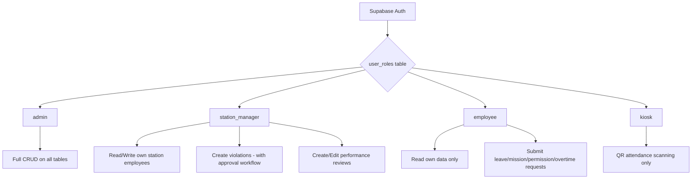

# HR System — Supabase Architecture

> **Last Updated:** 2026-03-05  
> **Database:** PostgreSQL via Lovable Cloud (Supabase)  
> **Project ID:** `iygkzkglrkdrmuyeuiht`

---

## Table of Contents

1. [Overview](#overview)
2. [Enums](#enums)
3. [Entity Relationship Diagram](#entity-relationship-diagram)
4. [Role-Based Access Model](#role-based-access-model)
5. [Core Tables](#core-tables)
6. [Module Tables](#module-tables)
7. [Views](#views)
8. [Database Functions](#database-functions)
9. [Triggers](#triggers)
10. [Indexes](#indexes)
11. [Unique Constraints](#unique-constraints)
12. [RLS Policy Summary](#rls-policy-summary)
13. [Edge Functions](#edge-functions)
14. [Realtime Publications](#realtime-publications)
15. [Secrets](#secrets)
16. [Migration Guide — Recreate from Scratch](#migration-guide--recreate-from-scratch)

---

## Overview

This document describes the **complete** Postgres schema, RLS policies, functions, triggers, indexes, and edge functions for the HR management system. The system supports four roles: **admin**, **station_manager**, **employee**, and **kiosk**, all enforced via Row-Level Security.

**Total Tables:** 35 (33 base tables + 1 view + profiles)  
**All tables have RLS enabled.**

---

## Enums

```sql
CREATE TYPE public.app_role AS ENUM ('admin', 'station_manager', 'employee', 'kiosk');
CREATE TYPE public.employee_status AS ENUM ('active', 'inactive', 'suspended');
```

---

## Entity Relationship Diagram


```mermaid
erDiagram
    auth_users ||--o| profiles : "1:1 (FK cascade)"
    auth_users ||--o{ user_roles : "1:N (FK cascade)"
    profiles ||--o| employees : "linked via user_id"
    
    stations ||--o{ employees : "1:N"
    departments ||--o{ employees : "1:N"
    stations ||--o{ user_roles : "station_managers"
    stations ||--o{ qr_locations : "1:N"
    
    employees ||--o{ attendance_records : "1:N"
    employees ||--o{ attendance_events : "1:N"
    employees ||--o{ salary_records : "1:N"
    employees ||--o{ payroll_entries : "1:N"
    employees ||--o{ loans : "1:N"
    employees ||--o{ advances : "1:N"
    employees ||--o{ loan_installments : "1:N (via loan)"
    employees ||--o{ performance_reviews : "1:N"
    employees ||--o{ training_records : "1:N"
    employees ||--o{ training_acknowledgments : "1:N"
    employees ||--o{ training_debts : "1:N"
    employees ||--o{ missions : "1:N"
    employees ||--o{ violations : "1:N"
    employees ||--o{ mobile_bills : "1:N"
    employees ||--o{ leave_requests : "1:N"
    employees ||--o{ leave_balances : "1:N"
    employees ||--o{ permission_requests : "1:N"
    employees ||--o{ overtime_requests : "1:N"
    employees ||--o{ uniforms : "1:N"
    employees ||--o{ employee_documents : "1:N"
    employees ||--o{ notifications : "1:N"
    employees ||--o{ planned_course_assignments : "1:N"

    loans ||--o{ loan_installments : "1:N (FK cascade)"
    training_courses ||--o{ training_records : "1:N"
    training_courses ||--o{ planned_courses : "1:N (optional)"
    planned_courses ||--o{ planned_course_assignments : "1:N"
    training_records ||--o{ training_acknowledgments : "1:N"
    
    user_roles ||--o| employees : "FK set null"
    permission_profiles ||--o{ user_module_permissions : "profile_id"
```

---

## Role-Based Access Model


```mermaid
flowchart TD
    A[Supabase Auth] --> B{user_roles table}
    B --> C[admin]
    B --> D[station_manager]
    B --> E[employee]
    B --> F[kiosk]

    C --> G[Full CRUD on all tables]
    D --> H[Read/Write own station employees]
    D --> I[Create violations - with approval workflow]
    D --> J[Create/Edit performance reviews]
    E --> K[Read own data only]
    E --> L[Submit leave/mission/permission/overtime requests]
    F --> M[QR attendance scanning only]
```

---

## Core Tables

### 1. `stations`
| Column | Type | Nullable | Default | Notes |
|--------|------|----------|---------|-------|
| id | uuid PK | NO | gen_random_uuid() | |
| code | text UNIQUE | NO | | e.g. 'cairo', 'alex' |
| name_ar | text | NO | | |
| name_en | text | NO | | |
| timezone | text | NO | 'Africa/Cairo' | |
| is_active | boolean | NO | true | |
| created_at | timestamptz | NO | now() | |

**FK:** None  
**RLS:** Admin full CRUD; Authenticated read

### 2. `departments`
| Column | Type | Nullable | Default | Notes |
|--------|------|----------|---------|-------|
| id | uuid PK | NO | gen_random_uuid() | |
| name_ar | text | NO | | |
| name_en | text | NO | | |
| is_active | boolean | NO | true | |
| created_at | timestamptz | NO | now() | |

**FK:** None  
**RLS:** Admin full CRUD; Authenticated read

### 3. `profiles`
Mirrors `auth.users` for queryable user data. Auto-created by trigger on auth.users INSERT.

| Column | Type | Nullable | Default | Notes |
|--------|------|----------|---------|-------|
| id | uuid PK | NO | | = auth.users.id |
| email | text | YES | | |
| full_name | text | YES | | |
| avatar_url | text | YES | | |
| created_at | timestamptz | NO | now() | |

**FK:** `profiles.id → auth.users(id) ON DELETE CASCADE`  
**RLS:** Self-read, self-update; Admin read all; **No INSERT/DELETE from client**

### 4. `user_roles`
| Column | Type | Nullable | Default | Notes |
|--------|------|----------|---------|-------|
| id | uuid PK | NO | gen_random_uuid() | |
| user_id | uuid | NO | | FK auth.users(id) CASCADE |
| role | app_role | NO | | admin, station_manager, employee, kiosk |
| station_id | uuid | YES | | FK stations(id), for station_manager |
| employee_id | uuid | YES | | FK employees(id) SET NULL, for employee role |

**UNIQUE:** (user_id, role)  
**RLS:** Admin full CRUD; Users read own roles

### 5. `user_module_permissions`
| Column | Type | Nullable | Default | Notes |
|--------|------|----------|---------|-------|
| id | uuid PK | NO | gen_random_uuid() | |
| user_id | uuid UNIQUE | NO | | |
| profile_id | uuid | YES | | FK permission_profiles |
| custom_modules | jsonb | YES | | |
| created_at | timestamptz | NO | now() | |

**RLS:** Admin full CRUD; Users read own permissions

### 6. `permission_profiles`
| Column | Type | Nullable | Default | Notes |
|--------|------|----------|---------|-------|
| id | uuid PK | NO | gen_random_uuid() | |
| name_ar | text | NO | | |
| name_en | text | NO | | |
| description_ar | text | YES | | |
| description_en | text | YES | | |
| modules | jsonb | NO | '[]' | Array of module access definitions |
| is_system | boolean | NO | false | |
| created_at | timestamptz | NO | now() | |

**RLS:** Admin full CRUD; Authenticated read

### 7. `user_devices`
| Column | Type | Nullable | Default | Notes |
|--------|------|----------|---------|-------|
| id | uuid PK | NO | gen_random_uuid() | |
| user_id | uuid | NO | | |
| device_id | text UNIQUE | NO | | Device fingerprint |
| bound_at | timestamptz | NO | now() | |

**RLS:** Admin full CRUD; Users read own device

### 8. `device_alerts`
| Column | Type | Nullable | Default | Notes |
|--------|------|----------|---------|-------|
| id | uuid PK | NO | gen_random_uuid() | |
| user_id | uuid | NO | | |
| device_id | text | NO | | |
| reason | text | NO | | |
| meta | jsonb | YES | | |
| triggered_at | timestamptz | NO | now() | |

**RLS:** Admin full CRUD only

---

## Module Tables

### 9. `employees`
| Column | Type | Nullable | Default | Notes |
|--------|------|----------|---------|-------|
| id | uuid PK | NO | gen_random_uuid() | |
| user_id | uuid | YES | | FK auth.users SET NULL |
| employee_code | text UNIQUE | NO | | e.g. 'Emp001' |
| name_ar | text | NO | | |
| name_en | text | NO | | |
| station_id | uuid | YES | | FK stations(id) |
| department_id | uuid | YES | | FK departments(id) |
| job_title_ar | text | YES | '' | |
| job_title_en | text | YES | '' | |
| phone | text | YES | '' | |
| email | text | YES | '' | |
| status | employee_status | NO | 'active' | |
| hire_date | date | YES | | |
| birth_date | date | YES | | |
| gender | text | YES | | |
| national_id | text | YES | | |
| basic_salary | numeric | YES | 0 | |
| bank_name | text | YES | | |
| bank_account_number | text | YES | | |
| bank_id_number | text | YES | | |
| bank_account_type | text | YES | | |
| contract_type | text | YES | | |
| first_name | text | YES | | |
| father_name | text | YES | | |
| family_name | text | YES | | |
| birth_place | text | YES | | |
| birth_governorate | text | YES | | |
| religion | text | YES | | |
| nationality | text | YES | | |
| marital_status | text | YES | | |
| children_count | integer | YES | 0 | |
| education_ar | text | YES | | |
| graduation_year | text | YES | | |
| home_phone | text | YES | | |
| address | text | YES | | |
| city | text | YES | | |
| governorate | text | YES | | |
| id_issue_date | date | YES | | |
| id_expiry_date | date | YES | | |
| issuing_authority | text | YES | | |
| issuing_governorate | text | YES | | |
| military_status | text | YES | | |
| dept_code | text | YES | | |
| job_level | text | YES | | |
| job_degree | text | YES | | |
| recruited_by | text | YES | | |
| employment_status | text | YES | 'active' | |
| resignation_date | date | YES | | |
| resignation_reason | text | YES | | |
| resigned | boolean | YES | false | |
| social_insurance_no | text | YES | | |
| social_insurance_start_date | date | YES | | |
| social_insurance_end_date | date | YES | | |
| health_insurance_card_no | text | YES | | |
| has_health_insurance | boolean | YES | false | |
| has_gov_health_insurance | boolean | YES | false | |
| has_social_insurance | boolean | YES | false | |
| has_cairo_airport_temp_permit | boolean | YES | false | |
| has_cairo_airport_annual_permit | boolean | YES | false | |
| has_airports_temp_permit | boolean | YES | false | |
| has_airports_annual_permit | boolean | YES | false | |
| temp_permit_no | text | YES | | |
| annual_permit_no | text | YES | | |
| airports_temp_permit_no | text | YES | | |
| airports_annual_permit_no | text | YES | | |
| airports_permit_type | text | YES | | |
| permit_name_en | text | YES | | |
| permit_name_ar | text | YES | | |
| has_qualification_cert | boolean | YES | false | |
| has_military_service_cert | boolean | YES | false | |
| has_birth_cert | boolean | YES | false | |
| has_id_copy | boolean | YES | false | |
| has_pledge | boolean | YES | false | |
| has_contract | boolean | YES | false | |
| has_receipt | boolean | YES | false | |
| attachments | text | YES | | |
| annual_leave_balance | numeric | YES | 21 | |
| sick_leave_balance | numeric | YES | 7 | |
| avatar | text | YES | | |
| notes | text | YES | | |
| created_at | timestamptz | NO | now() | |
| updated_at | timestamptz | NO | now() | Auto-updated by trigger |

**RLS:** Admin full CRUD; Station manager read own station; Employee read own record

### 10. `attendance_records`
| Column | Type | Nullable | Default | Notes |
|--------|------|----------|---------|-------|
| id | uuid PK | NO | gen_random_uuid() | |
| employee_id | uuid | NO | | FK employees CASCADE |
| date | date | NO | | |
| check_in | timestamptz | YES | | |
| check_out | timestamptz | YES | | |
| work_hours | numeric | YES | 0 | Computed by trigger |
| work_minutes | integer | YES | 0 | Computed by trigger |
| status | text | NO | 'present' | present, absent, late, mission |
| is_late | boolean | YES | false | |
| notes | text | YES | | |
| created_at | timestamptz | NO | now() | |

**RLS:** Admin full; Employee read/insert/update own; Station manager read/insert own station

### 11. `attendance_events`
QR-based attendance scan events.

| Column | Type | Nullable | Default | Notes |
|--------|------|----------|---------|-------|
| id | uuid PK | NO | gen_random_uuid() | |
| user_id | uuid | NO | | Scanning user |
| employee_id | uuid | YES | | FK employees |
| event_type | text | NO | | check_in / check_out |
| scan_time | timestamptz | NO | now() | |
| token_ts | timestamptz | NO | | QR token timestamp |
| device_id | text | NO | | |
| location_id | uuid | YES | | FK qr_locations |
| gps_lat | double precision | YES | | |
| gps_lng | double precision | YES | | |

**RLS:** Admin full; Users read own events

### 12. `qr_locations`
| Column | Type | Nullable | Default | Notes |
|--------|------|----------|---------|-------|
| id | uuid PK | NO | gen_random_uuid() | |
| name_ar | text | NO | | |
| name_en | text | NO | | |
| station_id | uuid | YES | | FK stations |
| latitude | double precision | YES | | |
| longitude | double precision | YES | | |
| radius_m | integer | YES | 150 | Geofence radius |
| is_active | boolean | NO | true | |
| created_at | timestamptz | NO | now() | |

**RLS:** Admin full CRUD; Authenticated read active locations

### 13. `salary_records`
Annual salary structure per employee.

| Column | Type | Nullable | Default | Notes |
|--------|------|----------|---------|-------|
| id | uuid PK | NO | gen_random_uuid() | |
| employee_id | uuid | NO | | FK employees CASCADE |
| year | text | NO | | |
| basic_salary | numeric | YES | 0 | |
| transport_allowance | numeric | YES | 0 | |
| incentives | numeric | YES | 0 | |
| living_allowance | numeric | YES | 0 | |
| station_allowance | numeric | YES | 0 | |
| mobile_allowance | numeric | YES | 0 | |
| employee_insurance | numeric | YES | 0 | |
| employer_social_insurance | numeric | YES | 0 | |
| health_insurance | numeric | YES | 0 | |
| income_tax | numeric | YES | 0 | |
| created_at | timestamptz | NO | now() | |

**UNIQUE:** (employee_id, year)  
**RLS:** Admin full; Employee read own

### 14. `payroll_entries`
Monthly processed payroll.

| Column | Type | Nullable | Default | Notes |
|--------|------|----------|---------|-------|
| id | uuid PK | NO | gen_random_uuid() | |
| employee_id | uuid | NO | | FK employees CASCADE |
| month | text | NO | | '01'–'12' |
| year | text | NO | | |
| basic_salary | numeric | YES | 0 | |
| transport_allowance | numeric | YES | 0 | |
| incentives | numeric | YES | 0 | |
| station_allowance | numeric | YES | 0 | |
| mobile_allowance | numeric | YES | 0 | |
| living_allowance | numeric | YES | 0 | |
| overtime_pay | numeric | YES | 0 | |
| bonus_type | text | YES | 'amount' | |
| bonus_value | numeric | YES | 0 | |
| bonus_amount | numeric | YES | 0 | Computed by trigger |
| gross | numeric | YES | 0 | Computed by trigger |
| employee_insurance | numeric | YES | 0 | |
| employer_social_insurance | numeric | YES | 0 | |
| health_insurance | numeric | YES | 0 | |
| income_tax | numeric | YES | 0 | |
| loan_payment | numeric | YES | 0 | |
| advance_amount | numeric | YES | 0 | |
| mobile_bill | numeric | YES | 0 | |
| leave_days | numeric | YES | 0 | |
| leave_deduction | numeric | YES | 0 | Computed by trigger |
| penalty_type | text | YES | 'amount' | |
| penalty_value | numeric | YES | 0 | |
| penalty_amount | numeric | YES | 0 | Computed by trigger |
| total_deductions | numeric | YES | 0 | Computed by trigger |
| net_salary | numeric | YES | 0 | Computed by trigger |
| processed_at | timestamptz | NO | now() | |

**UNIQUE:** (employee_id, month, year)  
**RLS:** Admin full; Employee read own

### 15. `loans`
| Column | Type | Nullable | Default | Notes |
|--------|------|----------|---------|-------|
| id | uuid PK | NO | gen_random_uuid() | |
| employee_id | uuid | NO | | FK employees CASCADE |
| amount | numeric | NO | | |
| monthly_installment | numeric | YES | 0 | Computed by trigger |
| installments_count | integer | NO | 1 | |
| paid_count | integer | YES | 0 | |
| remaining | numeric | YES | 0 | |
| status | text | NO | 'active' | active, completed, defaulted |
| start_date | date | NO | CURRENT_DATE | |
| reason | text | YES | | |
| created_at | timestamptz | NO | now() | |

**RLS:** Admin full; Employee read own

### 16. `loan_installments`
Auto-generated by trigger on loan creation.

| Column | Type | Nullable | Default | Notes |
|--------|------|----------|---------|-------|
| id | uuid PK | NO | gen_random_uuid() | |
| loan_id | uuid | NO | | FK loans CASCADE |
| employee_id | uuid | NO | | FK employees CASCADE |
| installment_number | integer | NO | | |
| amount | numeric | NO | | |
| due_date | date | NO | | |
| status | text | NO | 'pending' | pending, paid, overdue |
| paid_at | timestamptz | YES | | |
| created_at | timestamptz | NO | now() | |

**RLS:** Admin full; Employee read own

### 17. `advances`
| Column | Type | Nullable | Default | Notes |
|--------|------|----------|---------|-------|
| id | uuid PK | NO | gen_random_uuid() | |
| employee_id | uuid | NO | | FK employees CASCADE |
| amount | numeric | NO | | |
| deduction_month | text | NO | | YYYY-MM |
| status | text | NO | 'pending' | pending, approved, deducted |
| reason | text | YES | | |
| created_at | timestamptz | NO | now() | |

**RLS:** Admin full; Employee read own

### 18. `performance_reviews`
| Column | Type | Nullable | Default | Notes |
|--------|------|----------|---------|-------|
| id | uuid PK | NO | gen_random_uuid() | |
| employee_id | uuid | NO | | FK employees CASCADE |
| reviewer_id | uuid | YES | | FK auth.users |
| quarter | text | NO | | Q1-Q4 |
| year | text | NO | | |
| score | numeric | YES | 0 | Computed from criteria |
| status | text | NO | 'draft' | draft, submitted, approved |
| criteria | jsonb | YES | '[]' | [{name, score, weight}] |
| strengths | text | YES | | |
| improvements | text | YES | | |
| goals | text | YES | | |
| manager_comments | text | YES | | |
| review_date | date | YES | CURRENT_DATE | |
| created_at | timestamptz | NO | now() | |

**RLS:** Admin full; Employee read own; Station manager full for own station

### 19. `training_courses`
| Column | Type | Nullable | Default | Notes |
|--------|------|----------|---------|-------|
| id | uuid PK | NO | gen_random_uuid() | |
| name_ar | text | NO | | |
| name_en | text | NO | | |
| course_code | text | YES | '' | |
| description | text | YES | | |
| duration_hours | integer | YES | 0 | |
| course_duration | text | YES | '' | |
| course_objective | text | YES | '' | |
| basic_topics | text | YES | '' | |
| intermediate_topics | text | YES | '' | |
| advanced_topics | text | YES | '' | |
| exercises | text | YES | '' | |
| examination | text | YES | '' | |
| reference_material | text | YES | '' | |
| course_administration | text | YES | '' | |
| provider | text | YES | '' | |
| edited_by | text | YES | '' | |
| validity_years | integer | YES | 1 | |
| is_active | boolean | YES | true | |
| created_at | timestamptz | NO | now() | |

**RLS:** Admin full CRUD; Authenticated read

### 20. `training_records`
| Column | Type | Nullable | Default | Notes |
|--------|------|----------|---------|-------|
| id | uuid PK | NO | gen_random_uuid() | |
| employee_id | uuid | NO | | FK employees CASCADE |
| course_id | uuid | YES | | FK training_courses |
| status | text | NO | 'enrolled' | enrolled, completed, cancelled |
| start_date | date | YES | | |
| end_date | date | YES | | |
| planned_date | date | YES | | Auto-calculated |
| score | numeric | YES | | |
| cost | numeric | YES | 0 | |
| total_cost | numeric | YES | 0 | |
| provider | text | YES | | |
| location | text | YES | | |
| has_cert | boolean | YES | false | |
| has_cr | boolean | YES | false | |
| is_favorite | boolean | YES | false | |
| created_at | timestamptz | NO | now() | |

**RLS:** Admin full; Employee read own

### 21. `training_acknowledgments`
| Column | Type | Nullable | Default | Notes |
|--------|------|----------|---------|-------|
| id | uuid PK | NO | gen_random_uuid() | |
| training_record_id | uuid | NO | | FK training_records |
| employee_id | uuid | NO | | FK employees |
| acknowledged_at | timestamptz | NO | now() | |

**UNIQUE:** (training_record_id, employee_id)  
**RLS:** Admin full; Employee insert/read own

### 22. `training_debts`
| Column | Type | Nullable | Default | Notes |
|--------|------|----------|---------|-------|
| id | uuid PK | NO | gen_random_uuid() | |
| employee_id | uuid | NO | | FK employees |
| course_name | text | NO | | |
| cost | numeric | NO | 0 | |
| actual_date | date | NO | | |
| expiry_date | date | NO | | |
| created_at | timestamptz | NO | now() | |

**RLS:** Admin full; Employee read own

### 23. `planned_courses`
| Column | Type | Nullable | Default | Notes |
|--------|------|----------|---------|-------|
| id | uuid PK | NO | gen_random_uuid() | |
| course_id | uuid | YES | | FK training_courses |
| course_code | text | NO | '' | |
| course_name | text | NO | '' | |
| planned_date | date | YES | | |
| duration | text | YES | '' | |
| location | text | YES | '' | |
| trainer | text | YES | '' | |
| provider | text | YES | '' | |
| participants | integer | YES | 0 | |
| cost | numeric | YES | 0 | |
| status | text | NO | 'scheduled' | |
| created_at | timestamptz | NO | now() | |

**RLS:** Admin full CRUD; Authenticated read

### 24. `planned_course_assignments`
| Column | Type | Nullable | Default | Notes |
|--------|------|----------|---------|-------|
| id | uuid PK | NO | gen_random_uuid() | |
| planned_course_id | uuid | NO | | FK planned_courses |
| employee_id | uuid | NO | | FK employees |
| actual_date | date | YES | | |
| created_at | timestamptz | NO | now() | |

**UNIQUE:** (planned_course_id, employee_id)  
**RLS:** Admin full CRUD; Authenticated read

### 25. `missions`
| Column | Type | Nullable | Default | Notes |
|--------|------|----------|---------|-------|
| id | uuid PK | NO | gen_random_uuid() | |
| employee_id | uuid | NO | | FK employees CASCADE |
| mission_type | text | NO | 'full_day' | morning, evening, full_day |
| destination | text | YES | | |
| reason | text | YES | | |
| date | date | NO | | |
| check_in | time | YES | | Auto-set by type |
| check_out | time | YES | | Auto-set by type |
| hours | numeric | YES | 0 | |
| status | text | NO | 'pending' | pending, approved, rejected |
| approved_by | uuid | YES | | FK auth.users |
| created_at | timestamptz | NO | now() | |

**RLS:** Admin full; Employee insert/read own

### 26. `violations`
| Column | Type | Nullable | Default | Notes |
|--------|------|----------|---------|-------|
| id | uuid PK | NO | gen_random_uuid() | |
| employee_id | uuid | NO | | FK employees CASCADE |
| created_by | uuid | YES | | FK auth.users |
| type | text | NO | | |
| description | text | YES | | |
| penalty | text | YES | | |
| date | date | NO | CURRENT_DATE | |
| status | text | NO | 'pending' | pending, active, resolved |
| approved_by | uuid | YES | | FK auth.users |
| approved_at | timestamptz | YES | | |
| created_at | timestamptz | NO | now() | |

**RLS:** Admin full; Employee read own; Station manager full for own station

### 27. `mobile_bills`
| Column | Type | Nullable | Default | Notes |
|--------|------|----------|---------|-------|
| id | uuid PK | NO | gen_random_uuid() | |
| employee_id | uuid | NO | | FK employees CASCADE |
| amount | numeric | NO | 0 | |
| deduction_month | text | NO | | YYYY-MM |
| status | text | NO | 'pending' | pending, deducted |
| uploaded_by | uuid | YES | | FK auth.users |
| created_at | timestamptz | NO | now() | |

**UNIQUE:** (employee_id, deduction_month) — supports upsert  
**RLS:** Admin full; Employee read own

### 28. `leave_requests`
| Column | Type | Nullable | Default | Notes |
|--------|------|----------|---------|-------|
| id | uuid PK | NO | gen_random_uuid() | |
| employee_id | uuid | NO | | FK employees CASCADE |
| leave_type | text | NO | | annual, sick, casual, emergency, unpaid |
| start_date | date | NO | | |
| end_date | date | NO | | |
| days | integer | NO | 1 | |
| reason | text | YES | | |
| status | text | NO | 'pending' | pending, approved, rejected |
| approved_by | uuid | YES | | FK auth.users |
| rejection_reason | text | YES | | |
| created_at | timestamptz | NO | now() | |

**RLS:** Admin full; Employee insert/read own

### 29. `leave_balances`
| Column | Type | Nullable | Default | Notes |
|--------|------|----------|---------|-------|
| id | uuid PK | NO | gen_random_uuid() | |
| employee_id | uuid | NO | | FK employees |
| year | integer | NO | | |
| annual_total | numeric | NO | 21 | |
| annual_used | numeric | NO | 0 | |
| sick_total | numeric | NO | 15 | |
| sick_used | numeric | NO | 0 | |
| casual_total | numeric | NO | 7 | |
| casual_used | numeric | NO | 0 | |
| permissions_total | numeric | NO | 24 | |
| permissions_used | numeric | NO | 0 | |
| created_at | timestamptz | NO | now() | |

**UNIQUE:** (employee_id, year)  
**RLS:** Admin full; Employee read own

### 30. `permission_requests`
| Column | Type | Nullable | Default | Notes |
|--------|------|----------|---------|-------|
| id | uuid PK | NO | gen_random_uuid() | |
| employee_id | uuid | NO | | FK employees CASCADE |
| permission_type | text | NO | | |
| date | date | NO | | |
| start_time | time | NO | | |
| end_time | time | NO | | |
| hours | numeric | YES | 0 | |
| reason | text | YES | | |
| status | text | NO | 'pending' | |
| created_at | timestamptz | NO | now() | |

**RLS:** Admin full; Employee insert/read own

### 31. `overtime_requests`
| Column | Type | Nullable | Default | Notes |
|--------|------|----------|---------|-------|
| id | uuid PK | NO | gen_random_uuid() | |
| employee_id | uuid | NO | | FK employees CASCADE |
| date | date | NO | | |
| hours | numeric | NO | 0 | |
| reason | text | YES | | |
| status | text | NO | 'pending' | |
| created_at | timestamptz | NO | now() | |

**RLS:** Admin full; Employee insert/read own

### 32. `uniforms`
| Column | Type | Nullable | Default | Notes |
|--------|------|----------|---------|-------|
| id | uuid PK | NO | gen_random_uuid() | |
| employee_id | uuid | NO | | FK employees CASCADE |
| type_ar | text | NO | | |
| type_en | text | NO | | |
| quantity | integer | NO | 1 | |
| unit_price | numeric | YES | 0 | |
| total_price | numeric | YES | 0 | Computed by trigger |
| delivery_date | date | NO | | |
| notes | text | YES | | |
| created_at | timestamptz | NO | now() | |

**RLS:** Admin full; Employee read own

### 33. `employee_documents`
| Column | Type | Nullable | Default | Notes |
|--------|------|----------|---------|-------|
| id | uuid PK | NO | gen_random_uuid() | |
| employee_id | uuid | NO | | FK employees CASCADE |
| name | text | NO | | |
| type | text | YES | | |
| file_url | text | YES | | |
| uploaded_at | timestamptz | NO | now() | |

**RLS:** Admin full; Employee read own

### 34. `notifications`
| Column | Type | Nullable | Default | Notes |
|--------|------|----------|---------|-------|
| id | uuid PK | NO | gen_random_uuid() | |
| user_id | uuid | YES | | FK profiles |
| employee_id | uuid | YES | | FK employees |
| title_ar | text | NO | | |
| title_en | text | NO | | |
| desc_ar | text | YES | | |
| desc_en | text | YES | | |
| type | text | NO | 'info' | success, warning, info, error |
| module | text | NO | 'general' | |
| is_read | boolean | NO | false | |
| created_at | timestamptz | NO | now() | |

**RLS:** Admin full; User read/update own

### 35. `assets`
| Column | Type | Nullable | Default | Notes |
|--------|------|----------|---------|-------|
| id | uuid PK | NO | gen_random_uuid() | |
| asset_code | text UNIQUE | NO | | |
| name_ar | text | NO | | |
| name_en | text | NO | | |
| category | text | NO | 'other' | |
| brand | text | YES | | |
| model | text | YES | | |
| serial_number | text | YES | | |
| purchase_date | date | YES | | |
| purchase_price | numeric | YES | 0 | |
| status | text | NO | 'available' | available, assigned, maintenance, retired |
| condition | text | YES | 'good' | |
| location | text | YES | | |
| assigned_to | uuid | YES | | FK employees |
| notes | text | YES | | |
| created_at | timestamptz | NO | now() | |

**RLS:** Admin full CRUD; Authenticated read

---

## Views

### `employee_limited_view`
Restricted view of employees for station managers — excludes sensitive data (salary, national ID, bank details, insurance).

```sql
SELECT id, employee_code, name_ar, name_en, first_name, father_name, family_name,
       station_id, department_id, dept_code, job_title_ar, job_title_en, job_level,
       job_degree, phone, email, gender, status, hire_date, contract_type,
       employment_status, resigned, resignation_date, avatar, user_id, created_at, updated_at
FROM employees;
```

**No RLS on view** — access controlled via the querying role's policies on `employees`.

---

## Database Functions

| Function | Type | Purpose |
|----------|------|---------|
| `handle_new_user()` | SECURITY DEFINER | Creates profile on auth.users INSERT |
| `has_role(_user_id uuid, _role app_role)` | SECURITY DEFINER, STABLE | Check role without RLS recursion |
| `get_user_station_id(_user_id uuid)` | SECURITY DEFINER, STABLE | Get station_id for station_manager |
| `get_user_employee_id(_user_id uuid)` | SECURITY DEFINER, STABLE | Get employee_id for employee |
| `update_updated_at()` | SECURITY DEFINER | Sets updated_at = now() |
| `calculate_work_hours()` | SECURITY DEFINER | Computes work_hours/work_minutes from check_in/check_out |
| `generate_loan_installments()` | SECURITY DEFINER | Auto-generates loan_installments rows |
| `calculate_payroll_net()` | SECURITY DEFINER | Computes gross, deductions, net_salary |
| `auto_attendance_on_mission()` | SECURITY DEFINER | Creates attendance record on mission approval |
| `update_leave_balance_on_approval()` | SECURITY DEFINER | Deducts/restores leave balance on approval/un-approval |
| `prevent_permission_on_leave_day()` | SECURITY DEFINER | Blocks permission request on leave day |
| `upsert_mobile_bill(...)` | SECURITY DEFINER, RPC | Upserts mobile bill by employee+month |
| `calculate_uniform_total()` | SECURITY DEFINER | Computes total_price = quantity × unit_price |

---

## Triggers

| Trigger | Table | Event | Function |
|---------|-------|-------|----------|
| `trg_employees_updated_at` | employees | BEFORE UPDATE | `update_updated_at()` |
| `trg_calc_work_hours` | attendance_records | BEFORE INSERT/UPDATE | `calculate_work_hours()` |
| `trg_calc_payroll` | payroll_entries | BEFORE INSERT/UPDATE | `calculate_payroll_net()` |
| `trg_generate_loan_installments` | loans | AFTER INSERT | `generate_loan_installments()` |
| `trg_generate_installments` | loans | AFTER INSERT | `generate_loan_installments()` ⚠️ duplicate |
| `trg_auto_attendance_mission` | missions | AFTER UPDATE | `auto_attendance_on_mission()` |
| `trg_update_leave_balance` | leave_requests | AFTER UPDATE | `update_leave_balance_on_approval()` |
| `trg_update_leave_balance_insert` | leave_requests | AFTER INSERT | `update_leave_balance_on_approval()` |
| `trg_prevent_permission_on_leave_day` | permission_requests | BEFORE INSERT | `prevent_permission_on_leave_day()` |
| `trg_calc_uniform_total` | uniforms | BEFORE INSERT/UPDATE | `calculate_uniform_total()` |

> ⚠️ Note: `loans` table has 2 triggers calling the same function — `trg_generate_loan_installments` and `trg_generate_installments`. Consider removing one to avoid double installment generation.

---

## Indexes

| Table | Index | Type | Columns |
|-------|-------|------|---------|
| advances | idx_advances_emp | btree | employee_id |
| assets | idx_assets_assigned | btree | assigned_to |
| assets | idx_assets_status | btree | status |
| attendance_events | idx_attendance_events_user_time | btree | user_id, scan_time DESC |
| attendance_events | idx_attendance_events_employee | btree | employee_id, scan_time DESC |
| attendance_records | idx_attendance_emp | btree | employee_id |
| attendance_records | idx_attendance_employee_date | btree | employee_id, date |
| attendance_records | idx_attendance_emp_date | btree | employee_id, date ⚠️ duplicate |
| attendance_records | idx_attendance_status | btree | status |
| attendance_records | idx_attendance_date | btree | date |
| employee_documents | idx_documents_employee | btree | employee_id |
| employees | idx_emp_status / idx_employees_status | btree | status ⚠️ duplicate |
| employees | idx_employees_code | btree | employee_code |
| employees | idx_employees_department / idx_emp_dept | btree | department_id ⚠️ duplicate |
| employees | idx_employees_station / idx_emp_station | btree | station_id ⚠️ duplicate |
| employees | idx_emp_user | btree | user_id |
| leave_requests | idx_leave_emp / idx_leaves_employee | btree | employee_id ⚠️ duplicate |
| leave_requests | idx_leave_status / idx_leaves_status | btree | status ⚠️ duplicate |
| loan_installments | idx_installments_status | btree | status |
| loan_installments | idx_installments_due | btree | due_date |
| loan_installments | idx_installments_loan | btree | loan_id |
| loan_installments | idx_installments_employee | btree | employee_id |
| loans | idx_loans_employee | btree | employee_id |

> ⚠️ Several duplicate indexes exist. Consider cleanup in a future migration.

---

## Unique Constraints

| Table | Constraint | Columns |
|-------|-----------|---------|
| stations | uq_station_code, stations_code_key | (code) ⚠️ duplicate |
| employees | uq_employee_code, employees_employee_code_key | (employee_code) ⚠️ duplicate |
| salary_records | salary_records_employee_id_year_key, uq_salary_emp_year | (employee_id, year) ⚠️ duplicate |
| payroll_entries | payroll_entries_employee_id_month_year_key, uq_payroll_emp_month_year | (employee_id, month, year) ⚠️ duplicate |
| mobile_bills | uq_mobile_bill_emp_month, mobile_bills_employee_id_deduction_month_key | (employee_id, deduction_month) ⚠️ duplicate |
| assets | assets_asset_code_key | (asset_code) |
| leave_balances | leave_balances_employee_id_year_key | (employee_id, year) |
| planned_course_assignments | planned_course_assignments_planned_course_id_employee_id_key | (planned_course_id, employee_id) |
| user_module_permissions | user_module_permissions_user_id_key | (user_id) |
| user_devices | user_devices_device_id_key | (device_id) |
| user_roles | user_roles_user_id_role_key | (user_id, role) |
| training_acknowledgments | training_acknowledgments_training_record_id_employee_id_key | (training_record_id, employee_id) |

---

## RLS Policy Summary

All 35 tables have RLS **enabled**. Policy pattern:

| Role | Access Pattern |
|------|---------------|
| **Admin** | `has_role(auth.uid(), 'admin')` → Full CRUD on all tables |
| **Station Manager** | `has_role(auth.uid(), 'station_manager') AND employee.station_id = get_user_station_id(auth.uid())` → Scoped to own station for employees, attendance, violations, performance |
| **Employee** | `has_role(auth.uid(), 'employee') AND employee_id = get_user_employee_id(auth.uid())` → Own data only |
| **Kiosk** | Uses `attendance_events` via edge function (service role) |

---

## Edge Functions

| Function | JWT Verify | Purpose |
|----------|-----------|---------|
| `setup-user` | false | Create users with roles (first admin bootstrapping or admin-only) |
| `generate-qr-token` | false | Generate HMAC-signed QR tokens for attendance |
| `submit-scan` | false | Process QR attendance scan, validate device, geofence, create attendance record |
| `delete-user` | true | Delete user and all associated records |

---

## Realtime Publications

No tables are currently published to `supabase_realtime`.

---

## Secrets

| Name | Purpose |
|------|---------|
| LOVABLE_API_KEY | Lovable AI integration |
| QR_HMAC_SECRET | HMAC signing for QR attendance tokens |
| SUPABASE_URL | Auto-configured |
| SUPABASE_ANON_KEY | Auto-configured |
| SUPABASE_SERVICE_ROLE_KEY | Auto-configured |
| SUPABASE_DB_URL | Auto-configured |
| SUPABASE_PUBLISHABLE_KEY | Auto-configured |

---

## Migration Guide — Recreate from Scratch

If you need to recreate this database from scratch on a new Supabase project, run the following SQL scripts **in order**. Each section depends on the previous one.

### Step 1: Create Enums

```sql
CREATE TYPE public.app_role AS ENUM ('admin', 'station_manager', 'employee', 'kiosk');
CREATE TYPE public.employee_status AS ENUM ('active', 'inactive', 'suspended');
```

### Step 2: Create Core Tables

```sql
-- Stations
CREATE TABLE public.stations (
  id uuid PRIMARY KEY DEFAULT gen_random_uuid(),
  code text UNIQUE NOT NULL,
  name_ar text NOT NULL,
  name_en text NOT NULL,
  timezone text NOT NULL DEFAULT 'Africa/Cairo',
  is_active boolean NOT NULL DEFAULT true,
  created_at timestamptz NOT NULL DEFAULT now()
);

-- Departments
CREATE TABLE public.departments (
  id uuid PRIMARY KEY DEFAULT gen_random_uuid(),
  name_ar text NOT NULL,
  name_en text NOT NULL,
  is_active boolean NOT NULL DEFAULT true,
  created_at timestamptz NOT NULL DEFAULT now()
);

-- Profiles
CREATE TABLE public.profiles (
  id uuid PRIMARY KEY REFERENCES auth.users(id) ON DELETE CASCADE,
  email text,
  full_name text,
  avatar_url text,
  created_at timestamptz NOT NULL DEFAULT now()
);

-- Employees
CREATE TABLE public.employees (
  id uuid PRIMARY KEY DEFAULT gen_random_uuid(),
  user_id uuid REFERENCES auth.users(id) ON DELETE SET NULL,
  employee_code text UNIQUE NOT NULL,
  name_ar text NOT NULL,
  name_en text NOT NULL,
  station_id uuid REFERENCES public.stations(id),
  department_id uuid REFERENCES public.departments(id),
  job_title_ar text DEFAULT '',
  job_title_en text DEFAULT '',
  phone text DEFAULT '',
  email text DEFAULT '',
  status employee_status NOT NULL DEFAULT 'active',
  hire_date date,
  birth_date date,
  gender text,
  national_id text,
  basic_salary numeric DEFAULT 0,
  bank_name text,
  bank_account_number text,
  bank_id_number text,
  bank_account_type text,
  contract_type text,
  first_name text,
  father_name text,
  family_name text,
  birth_place text,
  birth_governorate text,
  religion text,
  nationality text,
  marital_status text,
  children_count integer DEFAULT 0,
  education_ar text,
  graduation_year text,
  home_phone text,
  address text,
  city text,
  governorate text,
  id_issue_date date,
  id_expiry_date date,
  issuing_authority text,
  issuing_governorate text,
  military_status text,
  dept_code text,
  job_level text,
  job_degree text,
  recruited_by text,
  employment_status text DEFAULT 'active',
  resignation_date date,
  resignation_reason text,
  resigned boolean DEFAULT false,
  social_insurance_no text,
  social_insurance_start_date date,
  social_insurance_end_date date,
  health_insurance_card_no text,
  has_health_insurance boolean DEFAULT false,
  has_gov_health_insurance boolean DEFAULT false,
  has_social_insurance boolean DEFAULT false,
  has_cairo_airport_temp_permit boolean DEFAULT false,
  has_cairo_airport_annual_permit boolean DEFAULT false,
  has_airports_temp_permit boolean DEFAULT false,
  has_airports_annual_permit boolean DEFAULT false,
  temp_permit_no text,
  annual_permit_no text,
  airports_temp_permit_no text,
  airports_annual_permit_no text,
  airports_permit_type text,
  permit_name_en text,
  permit_name_ar text,
  has_qualification_cert boolean DEFAULT false,
  has_military_service_cert boolean DEFAULT false,
  has_birth_cert boolean DEFAULT false,
  has_id_copy boolean DEFAULT false,
  has_pledge boolean DEFAULT false,
  has_contract boolean DEFAULT false,
  has_receipt boolean DEFAULT false,
  attachments text,
  annual_leave_balance numeric DEFAULT 21,
  sick_leave_balance numeric DEFAULT 7,
  avatar text,
  notes text,
  created_at timestamptz NOT NULL DEFAULT now(),
  updated_at timestamptz NOT NULL DEFAULT now()
);

-- User Roles
CREATE TABLE public.user_roles (
  id uuid PRIMARY KEY DEFAULT gen_random_uuid(),
  user_id uuid NOT NULL REFERENCES auth.users(id) ON DELETE CASCADE,
  role app_role NOT NULL,
  station_id uuid REFERENCES public.stations(id),
  employee_id uuid REFERENCES public.employees(id) ON DELETE SET NULL,
  UNIQUE(user_id, role)
);

-- Permission Profiles
CREATE TABLE public.permission_profiles (
  id uuid PRIMARY KEY DEFAULT gen_random_uuid(),
  name_ar text NOT NULL,
  name_en text NOT NULL,
  description_ar text,
  description_en text,
  modules jsonb NOT NULL DEFAULT '[]',
  is_system boolean NOT NULL DEFAULT false,
  created_at timestamptz NOT NULL DEFAULT now()
);

-- User Module Permissions
CREATE TABLE public.user_module_permissions (
  id uuid PRIMARY KEY DEFAULT gen_random_uuid(),
  user_id uuid NOT NULL UNIQUE,
  profile_id uuid,
  custom_modules jsonb,
  created_at timestamptz NOT NULL DEFAULT now()
);

-- User Devices
CREATE TABLE public.user_devices (
  id uuid PRIMARY KEY DEFAULT gen_random_uuid(),
  user_id uuid NOT NULL,
  device_id text NOT NULL UNIQUE,
  bound_at timestamptz NOT NULL DEFAULT now()
);

-- Device Alerts
CREATE TABLE public.device_alerts (
  id uuid PRIMARY KEY DEFAULT gen_random_uuid(),
  user_id uuid NOT NULL,
  device_id text NOT NULL,
  reason text NOT NULL,
  meta jsonb,
  triggered_at timestamptz NOT NULL DEFAULT now()
);
```

### Step 3: Create Module Tables

```sql
-- Attendance Records
CREATE TABLE public.attendance_records (
  id uuid PRIMARY KEY DEFAULT gen_random_uuid(),
  employee_id uuid NOT NULL REFERENCES public.employees(id) ON DELETE CASCADE,
  date date NOT NULL,
  check_in timestamptz,
  check_out timestamptz,
  work_hours numeric DEFAULT 0,
  work_minutes integer DEFAULT 0,
  status text NOT NULL DEFAULT 'present',
  is_late boolean DEFAULT false,
  notes text,
  created_at timestamptz NOT NULL DEFAULT now()
);

-- Attendance Events (QR scans)
CREATE TABLE public.attendance_events (
  id uuid PRIMARY KEY DEFAULT gen_random_uuid(),
  user_id uuid NOT NULL,
  employee_id uuid REFERENCES public.employees(id),
  event_type text NOT NULL,
  scan_time timestamptz NOT NULL DEFAULT now(),
  token_ts timestamptz NOT NULL,
  device_id text NOT NULL,
  location_id uuid REFERENCES public.qr_locations(id),
  gps_lat double precision,
  gps_lng double precision
);

-- QR Locations
CREATE TABLE public.qr_locations (
  id uuid PRIMARY KEY DEFAULT gen_random_uuid(),
  name_ar text NOT NULL,
  name_en text NOT NULL,
  station_id uuid REFERENCES public.stations(id),
  latitude double precision,
  longitude double precision,
  radius_m integer DEFAULT 150,
  is_active boolean NOT NULL DEFAULT true,
  created_at timestamptz NOT NULL DEFAULT now()
);

-- Salary Records
CREATE TABLE public.salary_records (
  id uuid PRIMARY KEY DEFAULT gen_random_uuid(),
  employee_id uuid NOT NULL REFERENCES public.employees(id) ON DELETE CASCADE,
  year text NOT NULL,
  basic_salary numeric DEFAULT 0,
  transport_allowance numeric DEFAULT 0,
  incentives numeric DEFAULT 0,
  living_allowance numeric DEFAULT 0,
  station_allowance numeric DEFAULT 0,
  mobile_allowance numeric DEFAULT 0,
  employee_insurance numeric DEFAULT 0,
  employer_social_insurance numeric DEFAULT 0,
  health_insurance numeric DEFAULT 0,
  income_tax numeric DEFAULT 0,
  created_at timestamptz NOT NULL DEFAULT now(),
  UNIQUE(employee_id, year)
);

-- Payroll Entries
CREATE TABLE public.payroll_entries (
  id uuid PRIMARY KEY DEFAULT gen_random_uuid(),
  employee_id uuid NOT NULL REFERENCES public.employees(id) ON DELETE CASCADE,
  month text NOT NULL,
  year text NOT NULL,
  basic_salary numeric DEFAULT 0,
  transport_allowance numeric DEFAULT 0,
  incentives numeric DEFAULT 0,
  station_allowance numeric DEFAULT 0,
  mobile_allowance numeric DEFAULT 0,
  living_allowance numeric DEFAULT 0,
  overtime_pay numeric DEFAULT 0,
  bonus_type text DEFAULT 'amount',
  bonus_value numeric DEFAULT 0,
  bonus_amount numeric DEFAULT 0,
  gross numeric DEFAULT 0,
  employee_insurance numeric DEFAULT 0,
  employer_social_insurance numeric DEFAULT 0,
  health_insurance numeric DEFAULT 0,
  income_tax numeric DEFAULT 0,
  loan_payment numeric DEFAULT 0,
  advance_amount numeric DEFAULT 0,
  mobile_bill numeric DEFAULT 0,
  leave_days numeric DEFAULT 0,
  leave_deduction numeric DEFAULT 0,
  penalty_type text DEFAULT 'amount',
  penalty_value numeric DEFAULT 0,
  penalty_amount numeric DEFAULT 0,
  total_deductions numeric DEFAULT 0,
  net_salary numeric DEFAULT 0,
  processed_at timestamptz NOT NULL DEFAULT now(),
  UNIQUE(employee_id, month, year)
);

-- Loans
CREATE TABLE public.loans (
  id uuid PRIMARY KEY DEFAULT gen_random_uuid(),
  employee_id uuid NOT NULL REFERENCES public.employees(id) ON DELETE CASCADE,
  amount numeric NOT NULL,
  monthly_installment numeric DEFAULT 0,
  installments_count integer NOT NULL DEFAULT 1,
  paid_count integer DEFAULT 0,
  remaining numeric DEFAULT 0,
  status text NOT NULL DEFAULT 'active',
  start_date date NOT NULL DEFAULT CURRENT_DATE,
  reason text,
  created_at timestamptz NOT NULL DEFAULT now()
);

-- Loan Installments
CREATE TABLE public.loan_installments (
  id uuid PRIMARY KEY DEFAULT gen_random_uuid(),
  loan_id uuid NOT NULL REFERENCES public.loans(id) ON DELETE CASCADE,
  employee_id uuid NOT NULL REFERENCES public.employees(id) ON DELETE CASCADE,
  installment_number integer NOT NULL,
  amount numeric NOT NULL,
  due_date date NOT NULL,
  status text NOT NULL DEFAULT 'pending',
  paid_at timestamptz,
  created_at timestamptz NOT NULL DEFAULT now()
);

-- Advances
CREATE TABLE public.advances (
  id uuid PRIMARY KEY DEFAULT gen_random_uuid(),
  employee_id uuid NOT NULL REFERENCES public.employees(id) ON DELETE CASCADE,
  amount numeric NOT NULL,
  deduction_month text NOT NULL,
  status text NOT NULL DEFAULT 'pending',
  reason text,
  created_at timestamptz NOT NULL DEFAULT now()
);

-- Performance Reviews
CREATE TABLE public.performance_reviews (
  id uuid PRIMARY KEY DEFAULT gen_random_uuid(),
  employee_id uuid NOT NULL REFERENCES public.employees(id) ON DELETE CASCADE,
  reviewer_id uuid REFERENCES auth.users(id),
  quarter text NOT NULL,
  year text NOT NULL,
  score numeric DEFAULT 0,
  status text NOT NULL DEFAULT 'draft',
  criteria jsonb DEFAULT '[]',
  strengths text,
  improvements text,
  goals text,
  manager_comments text,
  review_date date DEFAULT CURRENT_DATE,
  created_at timestamptz NOT NULL DEFAULT now()
);

-- Training Courses
CREATE TABLE public.training_courses (
  id uuid PRIMARY KEY DEFAULT gen_random_uuid(),
  name_ar text NOT NULL,
  name_en text NOT NULL,
  course_code text DEFAULT '',
  description text,
  duration_hours integer DEFAULT 0,
  course_duration text DEFAULT '',
  course_objective text DEFAULT '',
  basic_topics text DEFAULT '',
  intermediate_topics text DEFAULT '',
  advanced_topics text DEFAULT '',
  exercises text DEFAULT '',
  examination text DEFAULT '',
  reference_material text DEFAULT '',
  course_administration text DEFAULT '',
  provider text DEFAULT '',
  edited_by text DEFAULT '',
  validity_years integer DEFAULT 1,
  is_active boolean DEFAULT true,
  created_at timestamptz NOT NULL DEFAULT now()
);

-- Training Records
CREATE TABLE public.training_records (
  id uuid PRIMARY KEY DEFAULT gen_random_uuid(),
  employee_id uuid NOT NULL REFERENCES public.employees(id) ON DELETE CASCADE,
  course_id uuid REFERENCES public.training_courses(id),
  status text NOT NULL DEFAULT 'enrolled',
  start_date date,
  end_date date,
  planned_date date,
  score numeric,
  cost numeric DEFAULT 0,
  total_cost numeric DEFAULT 0,
  provider text,
  location text,
  has_cert boolean DEFAULT false,
  has_cr boolean DEFAULT false,
  is_favorite boolean DEFAULT false,
  created_at timestamptz NOT NULL DEFAULT now()
);

-- Training Acknowledgments
CREATE TABLE public.training_acknowledgments (
  id uuid PRIMARY KEY DEFAULT gen_random_uuid(),
  training_record_id uuid NOT NULL REFERENCES public.training_records(id),
  employee_id uuid NOT NULL REFERENCES public.employees(id),
  acknowledged_at timestamptz NOT NULL DEFAULT now(),
  UNIQUE(training_record_id, employee_id)
);

-- Training Debts
CREATE TABLE public.training_debts (
  id uuid PRIMARY KEY DEFAULT gen_random_uuid(),
  employee_id uuid NOT NULL REFERENCES public.employees(id),
  course_name text NOT NULL,
  cost numeric NOT NULL DEFAULT 0,
  actual_date date NOT NULL,
  expiry_date date NOT NULL,
  created_at timestamptz NOT NULL DEFAULT now()
);

-- Planned Courses
CREATE TABLE public.planned_courses (
  id uuid PRIMARY KEY DEFAULT gen_random_uuid(),
  course_id uuid REFERENCES public.training_courses(id),
  course_code text NOT NULL DEFAULT '',
  course_name text NOT NULL DEFAULT '',
  planned_date date,
  duration text DEFAULT '',
  location text DEFAULT '',
  trainer text DEFAULT '',
  provider text DEFAULT '',
  participants integer DEFAULT 0,
  cost numeric DEFAULT 0,
  status text NOT NULL DEFAULT 'scheduled',
  created_at timestamptz NOT NULL DEFAULT now()
);

-- Planned Course Assignments
CREATE TABLE public.planned_course_assignments (
  id uuid PRIMARY KEY DEFAULT gen_random_uuid(),
  planned_course_id uuid NOT NULL REFERENCES public.planned_courses(id),
  employee_id uuid NOT NULL REFERENCES public.employees(id),
  actual_date date,
  created_at timestamptz NOT NULL DEFAULT now(),
  UNIQUE(planned_course_id, employee_id)
);

-- Missions
CREATE TABLE public.missions (
  id uuid PRIMARY KEY DEFAULT gen_random_uuid(),
  employee_id uuid NOT NULL REFERENCES public.employees(id) ON DELETE CASCADE,
  mission_type text NOT NULL DEFAULT 'full_day',
  destination text,
  reason text,
  date date NOT NULL,
  check_in time,
  check_out time,
  hours numeric DEFAULT 0,
  status text NOT NULL DEFAULT 'pending',
  approved_by uuid REFERENCES auth.users(id),
  created_at timestamptz NOT NULL DEFAULT now()
);

-- Violations
CREATE TABLE public.violations (
  id uuid PRIMARY KEY DEFAULT gen_random_uuid(),
  employee_id uuid NOT NULL REFERENCES public.employees(id) ON DELETE CASCADE,
  created_by uuid REFERENCES auth.users(id),
  type text NOT NULL,
  description text,
  penalty text,
  date date NOT NULL DEFAULT CURRENT_DATE,
  status text NOT NULL DEFAULT 'pending',
  approved_by uuid REFERENCES auth.users(id),
  approved_at timestamptz,
  created_at timestamptz NOT NULL DEFAULT now()
);

-- Mobile Bills
CREATE TABLE public.mobile_bills (
  id uuid PRIMARY KEY DEFAULT gen_random_uuid(),
  employee_id uuid NOT NULL REFERENCES public.employees(id) ON DELETE CASCADE,
  amount numeric NOT NULL DEFAULT 0,
  deduction_month text NOT NULL,
  status text NOT NULL DEFAULT 'pending',
  uploaded_by uuid REFERENCES auth.users(id),
  created_at timestamptz NOT NULL DEFAULT now(),
  UNIQUE(employee_id, deduction_month)
);

-- Leave Requests
CREATE TABLE public.leave_requests (
  id uuid PRIMARY KEY DEFAULT gen_random_uuid(),
  employee_id uuid NOT NULL REFERENCES public.employees(id) ON DELETE CASCADE,
  leave_type text NOT NULL,
  start_date date NOT NULL,
  end_date date NOT NULL,
  days integer NOT NULL DEFAULT 1,
  reason text,
  status text NOT NULL DEFAULT 'pending',
  approved_by uuid REFERENCES auth.users(id),
  rejection_reason text,
  created_at timestamptz NOT NULL DEFAULT now()
);

-- Leave Balances
CREATE TABLE public.leave_balances (
  id uuid PRIMARY KEY DEFAULT gen_random_uuid(),
  employee_id uuid NOT NULL REFERENCES public.employees(id),
  year integer NOT NULL,
  annual_total numeric NOT NULL DEFAULT 21,
  annual_used numeric NOT NULL DEFAULT 0,
  sick_total numeric NOT NULL DEFAULT 15,
  sick_used numeric NOT NULL DEFAULT 0,
  casual_total numeric NOT NULL DEFAULT 7,
  casual_used numeric NOT NULL DEFAULT 0,
  permissions_total numeric NOT NULL DEFAULT 24,
  permissions_used numeric NOT NULL DEFAULT 0,
  created_at timestamptz NOT NULL DEFAULT now(),
  UNIQUE(employee_id, year)
);

-- Permission Requests
CREATE TABLE public.permission_requests (
  id uuid PRIMARY KEY DEFAULT gen_random_uuid(),
  employee_id uuid NOT NULL REFERENCES public.employees(id) ON DELETE CASCADE,
  permission_type text NOT NULL,
  date date NOT NULL,
  start_time time NOT NULL,
  end_time time NOT NULL,
  hours numeric DEFAULT 0,
  reason text,
  status text NOT NULL DEFAULT 'pending',
  created_at timestamptz NOT NULL DEFAULT now()
);

-- Overtime Requests
CREATE TABLE public.overtime_requests (
  id uuid PRIMARY KEY DEFAULT gen_random_uuid(),
  employee_id uuid NOT NULL REFERENCES public.employees(id) ON DELETE CASCADE,
  date date NOT NULL,
  hours numeric NOT NULL DEFAULT 0,
  reason text,
  status text NOT NULL DEFAULT 'pending',
  created_at timestamptz NOT NULL DEFAULT now()
);

-- Uniforms
CREATE TABLE public.uniforms (
  id uuid PRIMARY KEY DEFAULT gen_random_uuid(),
  employee_id uuid NOT NULL REFERENCES public.employees(id) ON DELETE CASCADE,
  type_ar text NOT NULL,
  type_en text NOT NULL,
  quantity integer NOT NULL DEFAULT 1,
  unit_price numeric DEFAULT 0,
  total_price numeric DEFAULT 0,
  delivery_date date NOT NULL,
  notes text,
  created_at timestamptz NOT NULL DEFAULT now()
);

-- Employee Documents
CREATE TABLE public.employee_documents (
  id uuid PRIMARY KEY DEFAULT gen_random_uuid(),
  employee_id uuid NOT NULL REFERENCES public.employees(id) ON DELETE CASCADE,
  name text NOT NULL,
  type text,
  file_url text,
  uploaded_at timestamptz NOT NULL DEFAULT now()
);

-- Notifications
CREATE TABLE public.notifications (
  id uuid PRIMARY KEY DEFAULT gen_random_uuid(),
  user_id uuid,
  employee_id uuid REFERENCES public.employees(id),
  title_ar text NOT NULL,
  title_en text NOT NULL,
  desc_ar text,
  desc_en text,
  type text NOT NULL DEFAULT 'info',
  module text NOT NULL DEFAULT 'general',
  is_read boolean NOT NULL DEFAULT false,
  created_at timestamptz NOT NULL DEFAULT now()
);

-- Assets
CREATE TABLE public.assets (
  id uuid PRIMARY KEY DEFAULT gen_random_uuid(),
  asset_code text UNIQUE NOT NULL,
  name_ar text NOT NULL,
  name_en text NOT NULL,
  category text NOT NULL DEFAULT 'other',
  brand text,
  model text,
  serial_number text,
  purchase_date date,
  purchase_price numeric DEFAULT 0,
  status text NOT NULL DEFAULT 'available',
  condition text DEFAULT 'good',
  location text,
  assigned_to uuid REFERENCES public.employees(id),
  notes text,
  created_at timestamptz NOT NULL DEFAULT now()
);
```

### Step 4: Create View

```sql
CREATE OR REPLACE VIEW public.employee_limited_view AS
SELECT id, employee_code, name_ar, name_en, first_name, father_name, family_name,
       station_id, department_id, dept_code, job_title_ar, job_title_en, job_level,
       job_degree, phone, email, gender, status, hire_date, contract_type,
       employment_status, resigned, resignation_date, avatar, user_id, created_at, updated_at
FROM public.employees;
```

### Step 5: Create Functions

```sql
-- Profile auto-creation
CREATE OR REPLACE FUNCTION public.handle_new_user()
RETURNS trigger LANGUAGE plpgsql SECURITY DEFINER SET search_path = 'public' AS $$
BEGIN
  INSERT INTO public.profiles (id, email, full_name)
  VALUES (NEW.id, NEW.email, COALESCE(NEW.raw_user_meta_data->>'full_name', NEW.email));
  RETURN NEW;
END;
$$;

-- IMPORTANT: Create trigger on auth.users
CREATE TRIGGER on_auth_user_created
  AFTER INSERT ON auth.users
  FOR EACH ROW EXECUTE FUNCTION public.handle_new_user();

-- Role check (SECURITY DEFINER to avoid RLS recursion)
CREATE OR REPLACE FUNCTION public.has_role(_user_id uuid, _role app_role)
RETURNS boolean LANGUAGE sql STABLE SECURITY DEFINER SET search_path = 'public' AS $$
  SELECT EXISTS (SELECT 1 FROM public.user_roles WHERE user_id = _user_id AND role = _role)
$$;

-- Station ID lookup
CREATE OR REPLACE FUNCTION public.get_user_station_id(_user_id uuid)
RETURNS uuid LANGUAGE sql STABLE SECURITY DEFINER SET search_path = 'public' AS $$
  SELECT station_id FROM public.user_roles WHERE user_id = _user_id AND role = 'station_manager' LIMIT 1
$$;

-- Employee ID lookup
CREATE OR REPLACE FUNCTION public.get_user_employee_id(_user_id uuid)
RETURNS uuid LANGUAGE sql STABLE SECURITY DEFINER SET search_path = 'public' AS $$
  SELECT employee_id FROM public.user_roles WHERE user_id = _user_id AND role = 'employee' LIMIT 1
$$;

-- Updated_at trigger function
CREATE OR REPLACE FUNCTION public.update_updated_at()
RETURNS trigger LANGUAGE plpgsql SECURITY DEFINER SET search_path = 'public' AS $$
BEGIN NEW.updated_at = now(); RETURN NEW; END;
$$;

-- Work hours calculation
CREATE OR REPLACE FUNCTION public.calculate_work_hours()
RETURNS trigger LANGUAGE plpgsql SECURITY DEFINER SET search_path = 'public' AS $$
DECLARE diff_minutes integer;
BEGIN
  IF NEW.check_in IS NOT NULL AND NEW.check_out IS NOT NULL THEN
    diff_minutes := EXTRACT(EPOCH FROM (NEW.check_out - NEW.check_in)) / 60;
    IF diff_minutes < 0 THEN diff_minutes := diff_minutes + 1440; END IF;
    NEW.work_hours := ROUND(diff_minutes / 60.0, 2);
    NEW.work_minutes := diff_minutes;
  ELSE
    NEW.work_hours := 0; NEW.work_minutes := 0;
  END IF;
  RETURN NEW;
END;
$$;

-- Loan installments generation
CREATE OR REPLACE FUNCTION public.generate_loan_installments()
RETURNS trigger LANGUAGE plpgsql SECURITY DEFINER SET search_path = 'public' AS $$
DECLARE inst_amount numeric(12,2); i integer; due date;
BEGIN
  IF NEW.installments_count <= 0 THEN NEW.installments_count := 1; END IF;
  inst_amount := ROUND(NEW.amount / NEW.installments_count, 2);
  NEW.monthly_installment := inst_amount;
  NEW.remaining := NEW.amount;
  NEW.paid_count := 0;
  FOR i IN 1..NEW.installments_count LOOP
    due := NEW.start_date + (i * INTERVAL '1 month')::interval;
    INSERT INTO public.loan_installments (loan_id, employee_id, installment_number, amount, due_date, status)
    VALUES (NEW.id, NEW.employee_id, i, inst_amount, due, 'pending');
  END LOOP;
  RETURN NEW;
END;
$$;

-- Payroll net calculation
CREATE OR REPLACE FUNCTION public.calculate_payroll_net()
RETURNS trigger LANGUAGE plpgsql SECURITY DEFINER SET search_path = 'public' AS $$
BEGIN
  IF NEW.bonus_type = 'percentage' THEN
    NEW.bonus_amount := ROUND(NEW.basic_salary * NEW.bonus_value / 100, 2);
  ELSE NEW.bonus_amount := COALESCE(NEW.bonus_value, 0); END IF;
  NEW.gross := COALESCE(NEW.basic_salary,0) + COALESCE(NEW.transport_allowance,0) + COALESCE(NEW.incentives,0)
    + COALESCE(NEW.station_allowance,0) + COALESCE(NEW.mobile_allowance,0) + COALESCE(NEW.living_allowance,0)
    + COALESCE(NEW.overtime_pay,0) + COALESCE(NEW.bonus_amount,0);
  IF NEW.penalty_type = 'days' THEN
    NEW.penalty_amount := ROUND(NEW.basic_salary / 30.0 * NEW.penalty_value, 2);
  ELSIF NEW.penalty_type = 'percentage' THEN
    NEW.penalty_amount := ROUND(NEW.basic_salary * NEW.penalty_value / 100, 2);
  ELSE NEW.penalty_amount := COALESCE(NEW.penalty_value, 0); END IF;
  NEW.leave_deduction := ROUND(COALESCE(NEW.basic_salary,0) / 30.0 * COALESCE(NEW.leave_days,0), 2);
  NEW.total_deductions := COALESCE(NEW.employee_insurance,0) + COALESCE(NEW.loan_payment,0)
    + COALESCE(NEW.advance_amount,0) + COALESCE(NEW.mobile_bill,0)
    + COALESCE(NEW.leave_deduction,0) + COALESCE(NEW.penalty_amount,0);
  NEW.net_salary := NEW.gross - NEW.total_deductions;
  RETURN NEW;
END;
$$;

-- Auto attendance on mission approval
CREATE OR REPLACE FUNCTION public.auto_attendance_on_mission()
RETURNS trigger LANGUAGE plpgsql SECURITY DEFINER SET search_path = 'public' AS $$
DECLARE ci time; co time; hrs numeric;
BEGIN
  IF NEW.status = 'approved' AND (OLD.status IS NULL OR OLD.status <> 'approved') THEN
    CASE NEW.mission_type
      WHEN 'morning' THEN ci := '09:00'; co := '14:00'; hrs := 5;
      WHEN 'evening' THEN ci := '14:00'; co := '17:00'; hrs := 3;
      ELSE ci := '09:00'; co := '17:00'; hrs := 8;
    END CASE;
    IF NEW.check_in IS NOT NULL THEN ci := NEW.check_in; END IF;
    IF NEW.check_out IS NOT NULL THEN co := NEW.check_out; END IF;
    INSERT INTO public.attendance_records (employee_id, date, check_in, check_out, status, notes)
    VALUES (NEW.employee_id, NEW.date,
      (NEW.date::text || ' ' || ci::text)::timestamptz,
      (NEW.date::text || ' ' || co::text)::timestamptz,
      'mission', 'مأمورية / Mission')
    ON CONFLICT DO NOTHING;
  END IF;
  RETURN NEW;
END;
$$;

-- Leave balance auto-update
CREATE OR REPLACE FUNCTION public.update_leave_balance_on_approval()
RETURNS trigger LANGUAGE plpgsql SECURITY DEFINER SET search_path = 'public' AS $$
DECLARE req_year integer; col_used text;
BEGIN
  IF NEW.status = 'approved' AND (OLD.status IS NULL OR OLD.status <> 'approved') THEN
    req_year := EXTRACT(YEAR FROM NEW.start_date);
    CASE NEW.leave_type
      WHEN 'annual' THEN col_used := 'annual_used';
      WHEN 'sick' THEN col_used := 'sick_used';
      WHEN 'casual' THEN col_used := 'casual_used';
      ELSE col_used := NULL;
    END CASE;
    IF col_used IS NOT NULL THEN
      INSERT INTO public.leave_balances (employee_id, year, annual_used, sick_used, casual_used)
      VALUES (NEW.employee_id, req_year, 0, 0, 0)
      ON CONFLICT (employee_id, year) DO NOTHING;
      EXECUTE format('UPDATE public.leave_balances SET %I = %I + $1 WHERE employee_id = $2 AND year = $3', col_used, col_used)
      USING NEW.days, NEW.employee_id, req_year;
    END IF;
  END IF;
  IF OLD.status = 'approved' AND NEW.status <> 'approved' THEN
    req_year := EXTRACT(YEAR FROM NEW.start_date);
    CASE OLD.leave_type
      WHEN 'annual' THEN col_used := 'annual_used';
      WHEN 'sick' THEN col_used := 'sick_used';
      WHEN 'casual' THEN col_used := 'casual_used';
      ELSE col_used := NULL;
    END CASE;
    IF col_used IS NOT NULL THEN
      EXECUTE format('UPDATE public.leave_balances SET %I = GREATEST(0, %I - $1) WHERE employee_id = $2 AND year = $3', col_used, col_used)
      USING OLD.days, OLD.employee_id, req_year;
    END IF;
  END IF;
  RETURN NEW;
END;
$$;

-- Prevent permission on leave day
CREATE OR REPLACE FUNCTION public.prevent_permission_on_leave_day()
RETURNS trigger LANGUAGE plpgsql SECURITY DEFINER SET search_path = 'public' AS $$
BEGIN
  IF EXISTS (
    SELECT 1 FROM public.leave_requests
    WHERE employee_id = NEW.employee_id AND status IN ('pending', 'approved')
      AND NEW.date BETWEEN start_date AND end_date
  ) THEN RAISE EXCEPTION 'Cannot request permission on a day with an existing leave request'; END IF;
  RETURN NEW;
END;
$$;

-- Upsert mobile bill (RPC)
CREATE OR REPLACE FUNCTION public.upsert_mobile_bill(p_employee_id uuid, p_amount numeric, p_deduction_month text, p_uploaded_by uuid)
RETURNS uuid LANGUAGE plpgsql SECURITY DEFINER SET search_path = 'public' AS $$
DECLARE result_id uuid;
BEGIN
  INSERT INTO public.mobile_bills (employee_id, amount, deduction_month, uploaded_by)
  VALUES (p_employee_id, p_amount, p_deduction_month, p_uploaded_by)
  ON CONFLICT (employee_id, deduction_month) DO UPDATE SET amount = EXCLUDED.amount, uploaded_by = EXCLUDED.uploaded_by
  RETURNING id INTO result_id;
  RETURN result_id;
END;
$$;

-- Uniform total calculation
CREATE OR REPLACE FUNCTION public.calculate_uniform_total()
RETURNS trigger LANGUAGE plpgsql SECURITY DEFINER SET search_path = 'public' AS $$
BEGIN
  NEW.total_price := COALESCE(NEW.quantity, 0) * COALESCE(NEW.unit_price, 0);
  RETURN NEW;
END;
$$;
```

### Step 6: Create Triggers

```sql
CREATE TRIGGER trg_employees_updated_at BEFORE UPDATE ON public.employees
  FOR EACH ROW EXECUTE FUNCTION public.update_updated_at();

CREATE TRIGGER trg_calc_work_hours BEFORE INSERT OR UPDATE ON public.attendance_records
  FOR EACH ROW EXECUTE FUNCTION public.calculate_work_hours();

CREATE TRIGGER trg_calc_payroll BEFORE INSERT OR UPDATE ON public.payroll_entries
  FOR EACH ROW EXECUTE FUNCTION public.calculate_payroll_net();

-- Only ONE trigger for loan installments (avoid duplicate)
CREATE TRIGGER trg_generate_installments AFTER INSERT ON public.loans
  FOR EACH ROW EXECUTE FUNCTION public.generate_loan_installments();

CREATE TRIGGER trg_auto_attendance_mission AFTER UPDATE ON public.missions
  FOR EACH ROW EXECUTE FUNCTION public.auto_attendance_on_mission();

CREATE TRIGGER trg_update_leave_balance AFTER UPDATE ON public.leave_requests
  FOR EACH ROW EXECUTE FUNCTION public.update_leave_balance_on_approval();

CREATE TRIGGER trg_update_leave_balance_insert AFTER INSERT ON public.leave_requests
  FOR EACH ROW EXECUTE FUNCTION public.update_leave_balance_on_approval();

CREATE TRIGGER trg_prevent_permission_on_leave_day BEFORE INSERT ON public.permission_requests
  FOR EACH ROW EXECUTE FUNCTION public.prevent_permission_on_leave_day();

CREATE TRIGGER trg_calc_uniform_total BEFORE INSERT OR UPDATE ON public.uniforms
  FOR EACH ROW EXECUTE FUNCTION public.calculate_uniform_total();
```

### Step 7: Create Indexes

```sql
CREATE INDEX idx_advances_emp ON public.advances(employee_id);
CREATE INDEX idx_assets_assigned ON public.assets(assigned_to);
CREATE INDEX idx_assets_status ON public.assets(status);
CREATE INDEX idx_attendance_events_user_time ON public.attendance_events(user_id, scan_time DESC);
CREATE INDEX idx_attendance_events_employee ON public.attendance_events(employee_id, scan_time DESC);
CREATE INDEX idx_attendance_emp_date ON public.attendance_records(employee_id, date);
CREATE INDEX idx_attendance_status ON public.attendance_records(status);
CREATE INDEX idx_attendance_date ON public.attendance_records(date);
CREATE INDEX idx_documents_employee ON public.employee_documents(employee_id);
CREATE INDEX idx_employees_status ON public.employees(status);
CREATE INDEX idx_employees_code ON public.employees(employee_code);
CREATE INDEX idx_employees_department ON public.employees(department_id);
CREATE INDEX idx_employees_station ON public.employees(station_id);
CREATE INDEX idx_emp_user ON public.employees(user_id);
CREATE INDEX idx_leave_emp ON public.leave_requests(employee_id);
CREATE INDEX idx_leave_status ON public.leave_requests(status);
CREATE INDEX idx_installments_status ON public.loan_installments(status);
CREATE INDEX idx_installments_due ON public.loan_installments(due_date);
CREATE INDEX idx_installments_loan ON public.loan_installments(loan_id);
CREATE INDEX idx_installments_employee ON public.loan_installments(employee_id);
CREATE INDEX idx_loans_employee ON public.loans(employee_id);
```

### Step 8: Enable RLS & Create Policies

```sql
-- Enable RLS on ALL tables
ALTER TABLE public.stations ENABLE ROW LEVEL SECURITY;
ALTER TABLE public.departments ENABLE ROW LEVEL SECURITY;
ALTER TABLE public.profiles ENABLE ROW LEVEL SECURITY;
ALTER TABLE public.employees ENABLE ROW LEVEL SECURITY;
ALTER TABLE public.user_roles ENABLE ROW LEVEL SECURITY;
ALTER TABLE public.user_module_permissions ENABLE ROW LEVEL SECURITY;
ALTER TABLE public.permission_profiles ENABLE ROW LEVEL SECURITY;
ALTER TABLE public.user_devices ENABLE ROW LEVEL SECURITY;
ALTER TABLE public.device_alerts ENABLE ROW LEVEL SECURITY;
ALTER TABLE public.attendance_records ENABLE ROW LEVEL SECURITY;
ALTER TABLE public.attendance_events ENABLE ROW LEVEL SECURITY;
ALTER TABLE public.qr_locations ENABLE ROW LEVEL SECURITY;
ALTER TABLE public.salary_records ENABLE ROW LEVEL SECURITY;
ALTER TABLE public.payroll_entries ENABLE ROW LEVEL SECURITY;
ALTER TABLE public.loans ENABLE ROW LEVEL SECURITY;
ALTER TABLE public.loan_installments ENABLE ROW LEVEL SECURITY;
ALTER TABLE public.advances ENABLE ROW LEVEL SECURITY;
ALTER TABLE public.performance_reviews ENABLE ROW LEVEL SECURITY;
ALTER TABLE public.training_courses ENABLE ROW LEVEL SECURITY;
ALTER TABLE public.training_records ENABLE ROW LEVEL SECURITY;
ALTER TABLE public.training_acknowledgments ENABLE ROW LEVEL SECURITY;
ALTER TABLE public.training_debts ENABLE ROW LEVEL SECURITY;
ALTER TABLE public.planned_courses ENABLE ROW LEVEL SECURITY;
ALTER TABLE public.planned_course_assignments ENABLE ROW LEVEL SECURITY;
ALTER TABLE public.missions ENABLE ROW LEVEL SECURITY;
ALTER TABLE public.violations ENABLE ROW LEVEL SECURITY;
ALTER TABLE public.mobile_bills ENABLE ROW LEVEL SECURITY;
ALTER TABLE public.leave_requests ENABLE ROW LEVEL SECURITY;
ALTER TABLE public.leave_balances ENABLE ROW LEVEL SECURITY;
ALTER TABLE public.permission_requests ENABLE ROW LEVEL SECURITY;
ALTER TABLE public.overtime_requests ENABLE ROW LEVEL SECURITY;
ALTER TABLE public.uniforms ENABLE ROW LEVEL SECURITY;
ALTER TABLE public.employee_documents ENABLE ROW LEVEL SECURITY;
ALTER TABLE public.notifications ENABLE ROW LEVEL SECURITY;
ALTER TABLE public.assets ENABLE ROW LEVEL SECURITY;

-- ========== POLICIES ==========

-- Stations
CREATE POLICY "Admins manage stations" ON public.stations FOR ALL USING (has_role(auth.uid(), 'admin')) WITH CHECK (has_role(auth.uid(), 'admin'));
CREATE POLICY "Authenticated can read stations" ON public.stations FOR SELECT USING (true);

-- Departments
CREATE POLICY "Admins manage departments" ON public.departments FOR ALL USING (has_role(auth.uid(), 'admin')) WITH CHECK (has_role(auth.uid(), 'admin'));
CREATE POLICY "Authenticated can read departments" ON public.departments FOR SELECT USING (true);

-- Profiles
CREATE POLICY "profiles_admin_read" ON public.profiles FOR SELECT USING (has_role(auth.uid(), 'admin'));
CREATE POLICY "profiles_select_self" ON public.profiles FOR SELECT USING (id = auth.uid());
CREATE POLICY "Users can update own profile" ON public.profiles FOR UPDATE USING (id = auth.uid()) WITH CHECK (id = auth.uid());

-- Employees
CREATE POLICY "Admins manage employees" ON public.employees FOR ALL USING (has_role(auth.uid(), 'admin')) WITH CHECK (has_role(auth.uid(), 'admin'));
CREATE POLICY "Station managers read own station employees" ON public.employees FOR SELECT USING (has_role(auth.uid(), 'station_manager') AND station_id = get_user_station_id(auth.uid()));
CREATE POLICY "Employees read own record" ON public.employees FOR SELECT USING (has_role(auth.uid(), 'employee') AND id = get_user_employee_id(auth.uid()));

-- User Roles
CREATE POLICY "Admins manage user_roles" ON public.user_roles FOR ALL USING (has_role(auth.uid(), 'admin')) WITH CHECK (has_role(auth.uid(), 'admin'));
CREATE POLICY "Users can read own roles" ON public.user_roles FOR SELECT USING (user_id = auth.uid());

-- User Module Permissions
CREATE POLICY "admin_user_module_permissions" ON public.user_module_permissions FOR ALL USING (has_role(auth.uid(), 'admin')) WITH CHECK (has_role(auth.uid(), 'admin'));
CREATE POLICY "user_own_permissions" ON public.user_module_permissions FOR SELECT USING (user_id = auth.uid());

-- Permission Profiles
CREATE POLICY "admin_permission_profiles" ON public.permission_profiles FOR ALL USING (has_role(auth.uid(), 'admin')) WITH CHECK (has_role(auth.uid(), 'admin'));
CREATE POLICY "read_permission_profiles" ON public.permission_profiles FOR SELECT USING (true);

-- User Devices
CREATE POLICY "admin_manage_devices" ON public.user_devices FOR ALL USING (has_role(auth.uid(), 'admin')) WITH CHECK (has_role(auth.uid(), 'admin'));
CREATE POLICY "read_own_device" ON public.user_devices FOR SELECT USING (auth.uid() = user_id);

-- Device Alerts
CREATE POLICY "admin_device_alerts" ON public.device_alerts FOR ALL USING (has_role(auth.uid(), 'admin')) WITH CHECK (has_role(auth.uid(), 'admin'));

-- Attendance Records
CREATE POLICY "admin_attendance" ON public.attendance_records FOR ALL USING (has_role(auth.uid(), 'admin')) WITH CHECK (has_role(auth.uid(), 'admin'));
CREATE POLICY "emp_attendance" ON public.attendance_records FOR SELECT USING (has_role(auth.uid(), 'employee') AND employee_id = get_user_employee_id(auth.uid()));
CREATE POLICY "emp_attendance_insert" ON public.attendance_records FOR INSERT WITH CHECK (has_role(auth.uid(), 'employee') AND employee_id = get_user_employee_id(auth.uid()));
CREATE POLICY "emp_attendance_update" ON public.attendance_records FOR UPDATE USING (has_role(auth.uid(), 'employee') AND employee_id = get_user_employee_id(auth.uid())) WITH CHECK (has_role(auth.uid(), 'employee') AND employee_id = get_user_employee_id(auth.uid()));
CREATE POLICY "sm_attendance_select" ON public.attendance_records FOR SELECT USING (has_role(auth.uid(), 'station_manager') AND employee_id IN (SELECT id FROM employees WHERE station_id = get_user_station_id(auth.uid())));
CREATE POLICY "sm_attendance_insert" ON public.attendance_records FOR INSERT WITH CHECK (has_role(auth.uid(), 'station_manager') AND employee_id IN (SELECT id FROM employees WHERE station_id = get_user_station_id(auth.uid())));

-- Attendance Events
CREATE POLICY "admin_read_all_attendance_events" ON public.attendance_events FOR ALL USING (has_role(auth.uid(), 'admin')) WITH CHECK (has_role(auth.uid(), 'admin'));
CREATE POLICY "read_own_attendance_events" ON public.attendance_events FOR SELECT USING (auth.uid() = user_id);

-- QR Locations
CREATE POLICY "admin_manage_qr_locations" ON public.qr_locations FOR ALL USING (has_role(auth.uid(), 'admin')) WITH CHECK (has_role(auth.uid(), 'admin'));
CREATE POLICY "auth_read_qr_locations" ON public.qr_locations FOR SELECT USING (is_active = true);

-- Salary Records
CREATE POLICY "admin_salary" ON public.salary_records FOR ALL USING (has_role(auth.uid(), 'admin')) WITH CHECK (has_role(auth.uid(), 'admin'));
CREATE POLICY "emp_salary" ON public.salary_records FOR SELECT USING (has_role(auth.uid(), 'employee') AND employee_id = get_user_employee_id(auth.uid()));

-- Payroll Entries
CREATE POLICY "admin_payroll" ON public.payroll_entries FOR ALL USING (has_role(auth.uid(), 'admin')) WITH CHECK (has_role(auth.uid(), 'admin'));
CREATE POLICY "emp_payroll" ON public.payroll_entries FOR SELECT USING (has_role(auth.uid(), 'employee') AND employee_id = get_user_employee_id(auth.uid()));

-- Loans
CREATE POLICY "admin_loans" ON public.loans FOR ALL USING (has_role(auth.uid(), 'admin')) WITH CHECK (has_role(auth.uid(), 'admin'));
CREATE POLICY "emp_loans" ON public.loans FOR SELECT USING (has_role(auth.uid(), 'employee') AND employee_id = get_user_employee_id(auth.uid()));

-- Loan Installments
CREATE POLICY "admin_installments" ON public.loan_installments FOR ALL USING (has_role(auth.uid(), 'admin')) WITH CHECK (has_role(auth.uid(), 'admin'));
CREATE POLICY "emp_installments" ON public.loan_installments FOR SELECT USING (has_role(auth.uid(), 'employee') AND employee_id = get_user_employee_id(auth.uid()));

-- Advances
CREATE POLICY "admin_advances" ON public.advances FOR ALL USING (has_role(auth.uid(), 'admin')) WITH CHECK (has_role(auth.uid(), 'admin'));
CREATE POLICY "emp_advances" ON public.advances FOR SELECT USING (has_role(auth.uid(), 'employee') AND employee_id = get_user_employee_id(auth.uid()));

-- Performance Reviews
CREATE POLICY "admin_perf" ON public.performance_reviews FOR ALL USING (has_role(auth.uid(), 'admin')) WITH CHECK (has_role(auth.uid(), 'admin'));
CREATE POLICY "emp_perf" ON public.performance_reviews FOR SELECT USING (has_role(auth.uid(), 'employee') AND employee_id = get_user_employee_id(auth.uid()));
CREATE POLICY "sm_perf_all" ON public.performance_reviews FOR ALL USING (has_role(auth.uid(), 'station_manager') AND employee_id IN (SELECT id FROM employees WHERE station_id = get_user_station_id(auth.uid()))) WITH CHECK (has_role(auth.uid(), 'station_manager') AND employee_id IN (SELECT id FROM employees WHERE station_id = get_user_station_id(auth.uid())));

-- Training Courses
CREATE POLICY "admin_courses" ON public.training_courses FOR ALL USING (has_role(auth.uid(), 'admin')) WITH CHECK (has_role(auth.uid(), 'admin'));
CREATE POLICY "read_courses" ON public.training_courses FOR SELECT USING (true);

-- Training Records
CREATE POLICY "admin_training" ON public.training_records FOR ALL USING (has_role(auth.uid(), 'admin')) WITH CHECK (has_role(auth.uid(), 'admin'));
CREATE POLICY "emp_training" ON public.training_records FOR SELECT USING (has_role(auth.uid(), 'employee') AND employee_id = get_user_employee_id(auth.uid()));

-- Training Acknowledgments
CREATE POLICY "admin_ack" ON public.training_acknowledgments FOR ALL USING (has_role(auth.uid(), 'admin')) WITH CHECK (has_role(auth.uid(), 'admin'));
CREATE POLICY "emp_ack_select" ON public.training_acknowledgments FOR SELECT USING (has_role(auth.uid(), 'employee') AND employee_id = get_user_employee_id(auth.uid()));
CREATE POLICY "emp_ack_insert" ON public.training_acknowledgments FOR INSERT WITH CHECK (has_role(auth.uid(), 'employee') AND employee_id = get_user_employee_id(auth.uid()));

-- Training Debts
CREATE POLICY "admin_debts" ON public.training_debts FOR ALL USING (has_role(auth.uid(), 'admin')) WITH CHECK (has_role(auth.uid(), 'admin'));
CREATE POLICY "emp_debts" ON public.training_debts FOR SELECT USING (has_role(auth.uid(), 'employee') AND employee_id = get_user_employee_id(auth.uid()));

-- Planned Courses
CREATE POLICY "admin_planned_courses" ON public.planned_courses FOR ALL USING (has_role(auth.uid(), 'admin')) WITH CHECK (has_role(auth.uid(), 'admin'));
CREATE POLICY "read_planned_courses" ON public.planned_courses FOR SELECT USING (true);

-- Planned Course Assignments
CREATE POLICY "admin_assignments" ON public.planned_course_assignments FOR ALL USING (has_role(auth.uid(), 'admin')) WITH CHECK (has_role(auth.uid(), 'admin'));
CREATE POLICY "read_assignments" ON public.planned_course_assignments FOR SELECT USING (true);

-- Missions
CREATE POLICY "admin_missions" ON public.missions FOR ALL USING (has_role(auth.uid(), 'admin')) WITH CHECK (has_role(auth.uid(), 'admin'));
CREATE POLICY "emp_missions_select" ON public.missions FOR SELECT USING (has_role(auth.uid(), 'employee') AND employee_id = get_user_employee_id(auth.uid()));
CREATE POLICY "emp_missions_insert" ON public.missions FOR INSERT WITH CHECK (has_role(auth.uid(), 'employee') AND employee_id = get_user_employee_id(auth.uid()));

-- Violations
CREATE POLICY "admin_violations" ON public.violations FOR ALL USING (has_role(auth.uid(), 'admin')) WITH CHECK (has_role(auth.uid(), 'admin'));
CREATE POLICY "emp_violations" ON public.violations FOR SELECT USING (has_role(auth.uid(), 'employee') AND employee_id = get_user_employee_id(auth.uid()));
CREATE POLICY "sm_violations_all" ON public.violations FOR ALL USING (has_role(auth.uid(), 'station_manager') AND employee_id IN (SELECT id FROM employees WHERE station_id = get_user_station_id(auth.uid()))) WITH CHECK (has_role(auth.uid(), 'station_manager') AND employee_id IN (SELECT id FROM employees WHERE station_id = get_user_station_id(auth.uid())));

-- Mobile Bills
CREATE POLICY "admin_bills" ON public.mobile_bills FOR ALL USING (has_role(auth.uid(), 'admin')) WITH CHECK (has_role(auth.uid(), 'admin'));
CREATE POLICY "emp_mobile_bills_select" ON public.mobile_bills FOR SELECT USING (has_role(auth.uid(), 'employee') AND employee_id = get_user_employee_id(auth.uid()));

-- Leave Requests
CREATE POLICY "admin_leaves" ON public.leave_requests FOR ALL USING (has_role(auth.uid(), 'admin')) WITH CHECK (has_role(auth.uid(), 'admin'));
CREATE POLICY "emp_leaves_select" ON public.leave_requests FOR SELECT USING (has_role(auth.uid(), 'employee') AND employee_id = get_user_employee_id(auth.uid()));
CREATE POLICY "emp_leaves_insert" ON public.leave_requests FOR INSERT WITH CHECK (has_role(auth.uid(), 'employee') AND employee_id = get_user_employee_id(auth.uid()));

-- Leave Balances
CREATE POLICY "admin_leave_balances" ON public.leave_balances FOR ALL USING (has_role(auth.uid(), 'admin')) WITH CHECK (has_role(auth.uid(), 'admin'));
CREATE POLICY "emp_leave_balances" ON public.leave_balances FOR SELECT USING (has_role(auth.uid(), 'employee') AND employee_id = get_user_employee_id(auth.uid()));

-- Permission Requests
CREATE POLICY "admin_permissions" ON public.permission_requests FOR ALL USING (has_role(auth.uid(), 'admin')) WITH CHECK (has_role(auth.uid(), 'admin'));
CREATE POLICY "emp_permissions_select" ON public.permission_requests FOR SELECT USING (has_role(auth.uid(), 'employee') AND employee_id = get_user_employee_id(auth.uid()));
CREATE POLICY "emp_permissions_insert" ON public.permission_requests FOR INSERT WITH CHECK (has_role(auth.uid(), 'employee') AND employee_id = get_user_employee_id(auth.uid()));

-- Overtime Requests
CREATE POLICY "admin_overtime" ON public.overtime_requests FOR ALL USING (has_role(auth.uid(), 'admin')) WITH CHECK (has_role(auth.uid(), 'admin'));
CREATE POLICY "emp_overtime_select" ON public.overtime_requests FOR SELECT USING (has_role(auth.uid(), 'employee') AND employee_id = get_user_employee_id(auth.uid()));
CREATE POLICY "emp_overtime_insert" ON public.overtime_requests FOR INSERT WITH CHECK (has_role(auth.uid(), 'employee') AND employee_id = get_user_employee_id(auth.uid()));

-- Uniforms
CREATE POLICY "admin_uniforms" ON public.uniforms FOR ALL USING (has_role(auth.uid(), 'admin')) WITH CHECK (has_role(auth.uid(), 'admin'));
CREATE POLICY "emp_uniforms" ON public.uniforms FOR SELECT USING (has_role(auth.uid(), 'employee') AND employee_id = get_user_employee_id(auth.uid()));

-- Employee Documents
CREATE POLICY "admin_docs" ON public.employee_documents FOR ALL USING (has_role(auth.uid(), 'admin')) WITH CHECK (has_role(auth.uid(), 'admin'));
CREATE POLICY "emp_docs" ON public.employee_documents FOR SELECT USING (has_role(auth.uid(), 'employee') AND employee_id = get_user_employee_id(auth.uid()));

-- Notifications
CREATE POLICY "admin_notifs" ON public.notifications FOR ALL USING (has_role(auth.uid(), 'admin')) WITH CHECK (has_role(auth.uid(), 'admin'));
CREATE POLICY "user_own_notifs" ON public.notifications FOR SELECT USING (user_id = auth.uid());
CREATE POLICY "user_update_notifs" ON public.notifications FOR UPDATE USING (user_id = auth.uid()) WITH CHECK (user_id = auth.uid());

-- Assets
CREATE POLICY "admin_assets" ON public.assets FOR ALL USING (has_role(auth.uid(), 'admin')) WITH CHECK (has_role(auth.uid(), 'admin'));
CREATE POLICY "read_assets" ON public.assets FOR SELECT USING (true);
```

### Step 9: Bootstrap First Admin

After setup, use the `setup-user` edge function to create the first admin user (no auth required when no admins exist):

```bash
curl -X POST https://<YOUR_PROJECT_ID>.supabase.co/functions/v1/setup-user \
  -H "Content-Type: application/json" \
  -d '{"email":"admin@example.com","password":"your-password","full_name":"Admin","role":"admin"}'
```

### Step 10: Configure Secrets

Set the following secrets in your Supabase project:
- `QR_HMAC_SECRET` — Random 32+ char string for QR token HMAC signing
- `LOVABLE_API_KEY` — If using Lovable AI features

### Notes for Migration

- ⚠️ **Duplicate indexes/constraints exist** in the current DB. The migration script above removes duplicates.
- ⚠️ **Duplicate loan trigger** (`trg_generate_loan_installments` + `trg_generate_installments`). Only one is included above.
- The `handle_new_user` trigger must be created on `auth.users` — this requires elevated privileges.
- Edge functions (`setup-user`, `generate-qr-token`, `submit-scan`, `delete-user`) must be deployed separately.
- No realtime publications are currently active.
- No storage buckets are currently configured.
